# 📘 THE IOT MICROSERVICES ENCYCLOPEDIA
## A Comprehensive Engineering Manifesto for Scalable IoT Systems

---

## 📜 Table of Contents

1.  **[Foreword: The IoT Revolution](#foreword)**
2.  **[Chapter 1: Architectural Philosophy](#chapter-1)**
3.  **[Chapter 2: Orchestrator-MS — The Central Nervous System](#chapter-2)**
4.  **[Chapter 3: Auth-MS — Identity in a Distributed World](#chapter-3)**
5.  **[Chapter 4: Measure-MS — Ingesting the Real World](#chapter-4)**
6.  **[Chapter 5: Microcontrollers-MS — The Device Registry](#chapter-5)**
7.  **[Chapter 6: Stats-MS — Intelligence from Chaos](#chapter-6)**
8.  **[Chapter 7: AI-MS — The Predictive Intelligence](#chapter-7)**
9.  **[Chapter 8: Publisher-MS & RabbitMQ — Seamless Message Flows](#chapter-8)**
10. **[Chapter 9: Angular-MS — The Human Interface](#chapter-9)**
11. **[Chapter 10: The Persistence Layer — Polyglot Databases](#chapter-10)**
12. **[Chapter 11: Kubernetes: The Industrial Orchestrator](#chapter-11)**
13. **[Chapter 12: Observability: Metrics, Logs, and Tracing](#chapter-12)**
14. **[Chapter 13: Engineering Excellence: TDD & CI/CD](#chapter-13)**
15. **[Chapter 14: The Simulation Layer: Fake Arduino IoT](#chapter-14)**
16. **[Chapter 15: Troubleshooting & Post-Mortems](#chapter-15)**
17. **[Chapter 16: Technical Roadmap & Future Improvements](#chapter-16)**
18. **[Chapter 17: Strategic Roadmap — The Execution Plan](#chapter-17)**
19. **[Conclusion: The Horizon of IoT](#conclusion)**

---

<a id="foreword"></a>
## 🚀 Foreword: The IoT Revolution

In the next decade, an estimated 75 billion devices will be connected to the internet. This represents a data deluge of unprecedented proportions. Traditional, monolithic software architectures—once the bedrock of enterprise systems—are fundamentally ill-equipped to handle the erratic, high-volume, and geographically distributed nature of IoT data.

This engineering manifesto documents the **IoT Microservices Project**, a scalable, resilient, and polyglot ecosystem designed for the modern era. We move away from the "Big Ball of Mud" toward a modular, decoupled architecture where each service fulfills a specific, bounded context.

Our vision is simple: **Decoupled sensing, Centralized intelligence.** By the end of this volume, you will understand how to build a system that not only survives the IoT revolution but thrives within it.

---

<a id="chapter-1"></a>
## 🏛️ Chapter 1: Architectural Philosophy

The transition from a monolith to a microservices architecture is not merely a change in deployment; it is a fundamental shift in how we perceive software reliability and scalability.

### 1.1 The Pillars of the Architecture

#### 1.1.1 Fault Isolation (The Bulkhead Pattern)
In a monolithic system, a memory leak in the statistics module could crash the entire application, preventing users from even logging in. In our microservices architecture, we implement the **Bulkhead Pattern**. If `stats-ms` (Python) experiences a kernel panic while calculating complex Fourier transforms on sensor data, the `auth-ms` (Go) remains completely unaffected.

#### 1.1.2 Polyglot Persistence
We acknowledge that no single database is optimal for every workload. 
*   **Relational (MySQL)** provides ACID compliance for user accounts and device registries.
*   **Document (MongoDB)** provides high-throughput ingestion for time-series sensor data.

#### 1.1.3 Asynchronous Backpressure
By using **RabbitMQ**, we decouple the "Data Ingestion" (Measure-MS) from "Data Analysis" (Stats-MS). If the ingestion rate spikes suddenly, messages are safely queued in RabbitMQ, and the analysis engine processes them at its own sustainable pace, preventing system-wide cascading failures.

### 1.2 The Communication Matrix

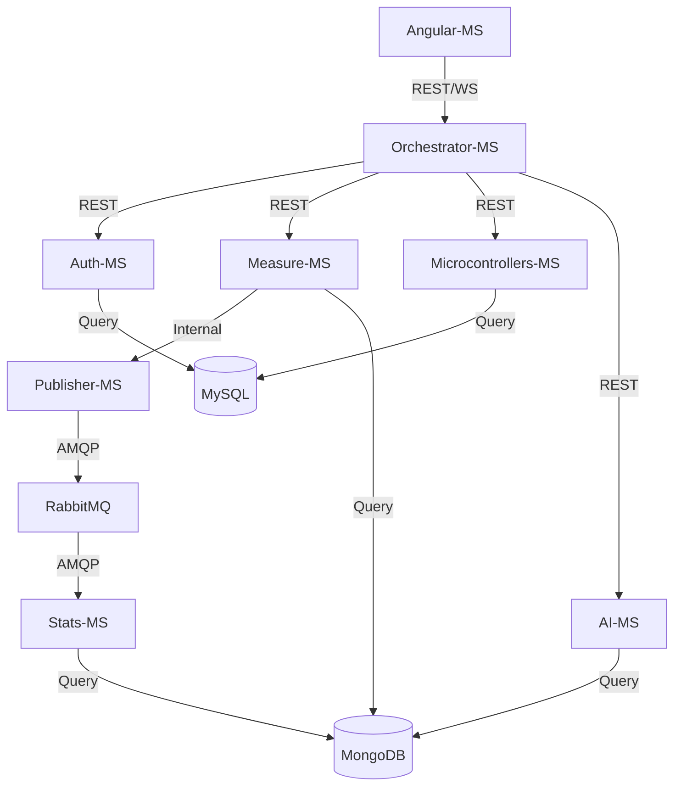

#### 1.2.1 Service-to-Service Secret Authentication
While the browser authenticates via JWT, internal pod-to-pod communication carries an additional layer of security. We implement **Internal API Keys** passed in the `x-internal-api-key` header. This ensures that even if a pod in the `default` namespace is compromised, it cannot spoof measurements into `measure-ms` without the shared cluster secret.

#### 1.2.2 The State-Aware Gateway
The **Orchestrator-MS** maintains an ephemeral map of active WebSocket connections. When a message arrives from RabbitMQ, the Orchestrator performs a **User-Routing Lookup**. It identifies which connected browser "owns" the sensor that generated the data and emits the update *only* to that specific socket room. This prevents leaking sensitive sensor data to other users in a multi-tenant environment.

---

<a id="chapter-2"></a>
## 🧠 Chapter 2: Orchestrator-MS — The Central Nervous System

The `orchestrator-ms` is the most critical service in the stack, acting as the **Identity-Aware Gateway** and the **Cognitive Hub** of the ecosystem. If the internal microservices are the organs, the Orchestrator is the nervous system that connects them and interacts with the external reality (the user's browser).

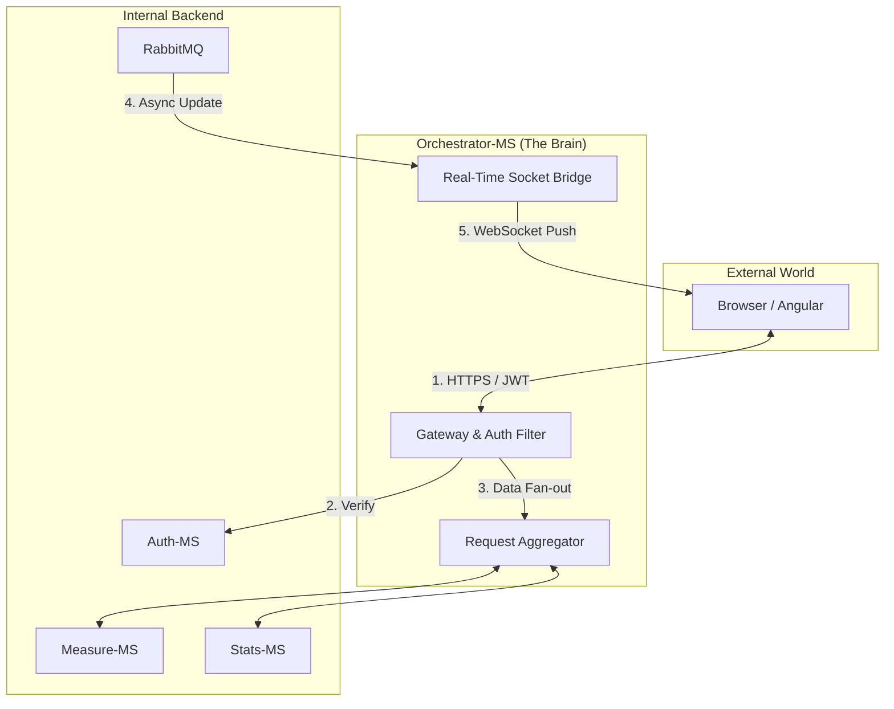

### 2.1 The Gateway Pattern & Edge Defense
The Orchestrator serves as the **Formal Entry Point** for all digital traffic. It implements the **Identity-Aware Proxy** pattern, ensuring that no request reaches the internal network without verification.
*   **Security Injection**: It validates the JWT from the browser, extracts the `username`, and injects it into internal requests. This allows backend services (like `measure-ms`) to remain "Auth-Agnostic," focusing purely on domain logic while inheriting security from the gateway.
*   **Cross-Cutting Concerns**: 
    *   **Rate Limiting**: Implements a sliding window via `express-rate-limit` (e.g., 5 auth attempts per 15 min) to thwart brute-force attacks.
    *   **JWT Validation**: Decodes and verifies signatures for every request, acting as the cluster's first line of defense.

### 2.2 Request Aggregation: The Great Unifier
When the dashboard initializes, it requires data from the **Registry** (`microcontrollers-ms`), **Current State** (`measure-ms`), and **Historical Trends** (`stats-ms`). The Orchestrator performs **Parallel Fan-out Queries**, aggregating these disparate JSON responses into a single, unified payload for the Angular frontend. This minimizes round-trip latency and simplifies frontend state management.

### 2.3 Global Traffic Management Logic
The Gateway utilizes a centralized `ServicesController` to manage outbound requests with consistent error handling and service discovery:

```javascript
async postToConnectedService(res, service, path = '', body, status, returnResponse) {
  const url = `http://${service}/${path}`
  try {
    const response = await axios.post(url, body);
    return res.status(status).json(response.data);
  } catch (error) {
    return res.status(400).send("Service Communication Error");
  }
}
```

### 2.4 The Real-Time Bridge (Socket.io)
We utilize **Socket.io** to synchronize the digital and physical worlds. The Orchestrator acts as a **RabbitMQ-to-WebSocket Bridge**:
1.  **Queue Monitoring**: Listens to RabbitMQ events emitted by `publisher-ms`.
2.  **User-Room Routing**: When a `measure_update` arrives, it identifies the "owner" and broadcasts specifically to that user’s socket room: `io.to(username).emit('measure_update', data);`
3.  **Zero-Latency Visuals**: This architecture ensures that the dashboard reflects physical sensor changes (like a temperature spike) in near-real-time without requiring a browser refresh.

### 2.5 Why Node.js?
Built on the **V8 Event Loop**, Node.js is uniquely suited for this role. It handles thousands of concurrent internal HTTP calls and long-lived WebSocket connections with a minimal memory footprint, ensuring the gateway remains non-blocking even under high telemetry load.

---

<a id="chapter-3"></a>
## 🔐 Chapter 3: Auth-MS — Identity in a Distributed World

The `auth-ms` is a high-performance identity provider written in **Go**.

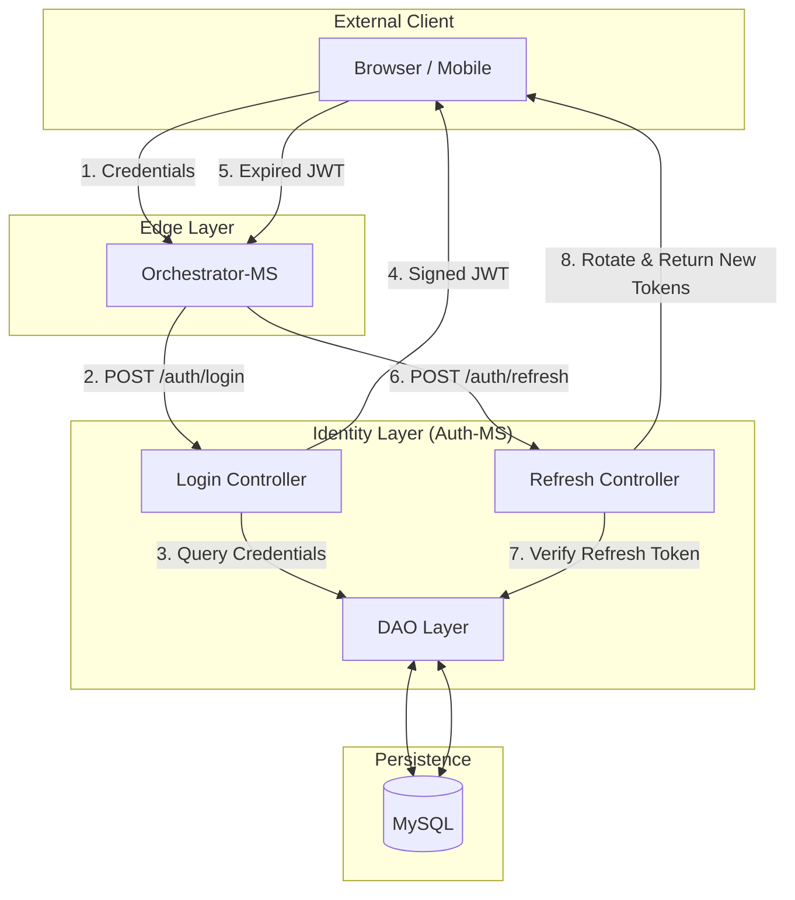

### 3.1 Why Go for Authentication?
In an IoT environment where thousands of devices might send "Check-in" heartbeats, the Authentication service is the most hit component. By using Go, we achieve:
*   **Minimal Memory Footprint**: Containers stay under 30MB of RAM.
*   **High Concurrency**: Lightweight goroutines handle thousands of simultaneous password verifications.

### 3.2 The Security Architecture

#### 3.2.1 Password Hashing Strategy
We utilize **SHA-256** for password hashing. The Orchestrator hashes the password before it reaches the internal network, ensuring "Pass-the-Hash" resilience.

#### 3.2.2 Token Lifecycle Management
*   **Access Token**: Signed JWT with `username` and `role` (10-minute TTL).
*   **Refresh Token**: Cryptographically random string stored in MySQL.
*   **Rotation Flow**: When a client requests a new access token, a **NEW** refresh token is issued, invalidating the old one. If an attacker steals a token, only one use is allowed before the sequence breaks.

### 3.3 The Data Access Object (DAO)
The Go DAO follows the **Repository Pattern**, allowing easy database swaps:
```go
type Repository interface {
	Exists(user model.User) (bool, model.User)
	Insert(user model.User) bool
	Update(credentials model.Credential) int64
}
```

---

<a id="chapter-4"></a>
## 🌡️ Chapter 4: Measure-MS — Ingesting the Real World

`measure-ms` represents the **Data Ingestion** layer.

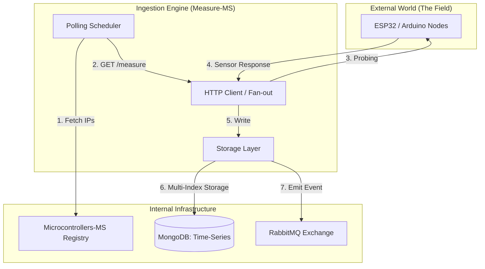

### 4.1 The Proactive Polling Engine
Unlike systems that wait for push data, `measure-ms` implements **Proactive Polling**. This is crucial for hardware behind firewalls.
1.  **Trigger**: Cron-job or user request triggers `getMeasure`.
2.  **Resource Discovery**: Fetches registered devices from `microcontrollers-ms`.
3.  **Fan-out Probing**: Initiates parallel HTTP GET requests using `Promise.all`.
4.  **Error Handling**: Distinguishes between "Timeouts" (Device down) and "Invalid Response" (Hardware failing).

### 4.2 MongoDB Storage Strategy
Sensor data is write-heavy. We optimize MongoDB using **Compound Indexes** on `(username, ip, timestamp)`. 
*   **Capped Collections**: Used for buffering binary picture data to prevent disk exhaustion.
*   **Historical Data**: A bucket-based strategy stores years of sensor history efficiently.

### 4.3 The Picture Scheduler
The `picture.scheduler.js` manages periodic visual snapshots from IoT cameras (e.g., every 10 hours), providing a visual history without saturating the network with video streams.

---

<a id="chapter-5"></a>
## 📡 Chapter 5: Microcontrollers-MS — The Device Registry

This service handles the **Digital Twin Meta-Data** and inventory for every sensor in the field.

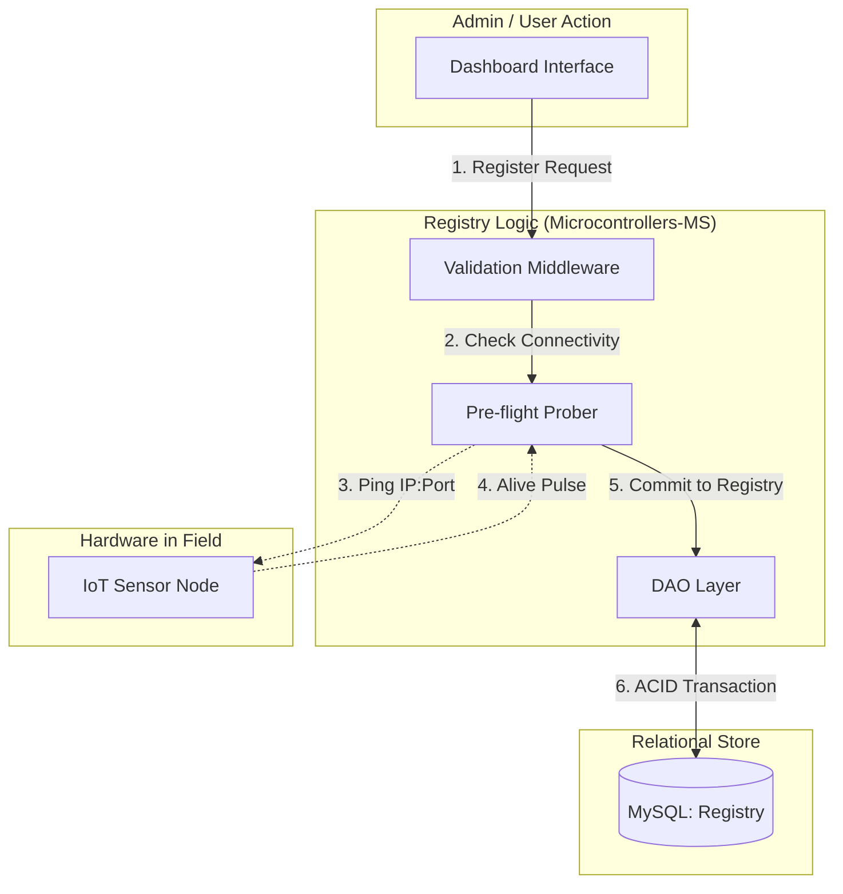

### 5.1 The Registration Protocol
Registering a new device requires its Magnitude, IP, and Port. The service performs a **pre-flight check** (pinging the IP:Port) before allowing the entry into the database to prevent "Ghost Devices."

### 5.2 The CRUD Pipeline & Integrity
We use MySQL for the registry because relational integrity is paramount.
*   **Integrity**: A device must be associated with exactly one user.
*   **IP Resolution**: Supports DNS names (like `living-room.local`), making it compatible with dynamic IP home networks.

---

<a id="chapter-6"></a>
## 📊 Chapter 6: Stats-MS — Intelligence from Chaos

`stats-ms` is the Python analytical service that handles **Refined Analytics**.

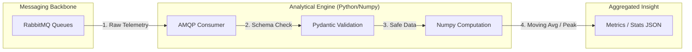

### 6.1 The Event-Driven Pipeline
The service is a **Consumer** in the RabbitMQ network, subscribing to magnitude queues.
1.  **Ingestion**: Receives JSON from RabbitMQ.
2.  **Validation**: Uses **Pydantic** models to ensure data quality (e.g., humidity 0-100%).
3.  **Computation**: Uses `Numpy` for lightning-fast array operations and rolling averages.

### 6.2 The Computational Intelligence
The service calculates:
*   **Moving Averages**: Smoothing sensor noise.
*   **Peak Detection**: Minimum/Maximum values over time windows.
*   **Anomalies**: Variance analysis to detect malfunctioning hardware.

---

<a id="chapter-7"></a>
## 🧠 Chapter 7: AI-MS — The Predictive Intelligence

The `ai-ms` represents the **Cognitive Layer** of the ecosystem, transitioning the project from reactive monitoring to proactive forecasting.

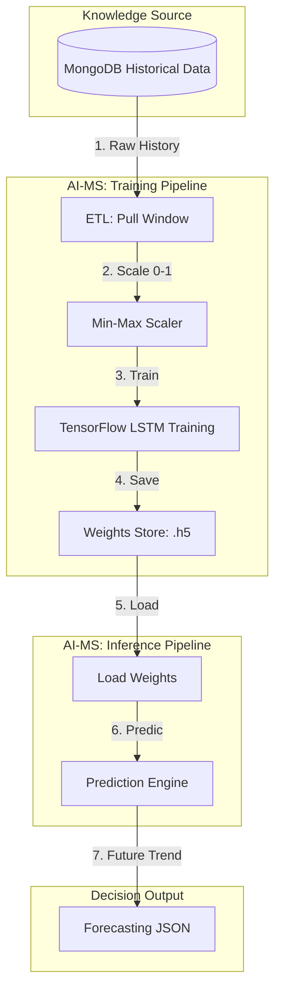

### 7.1 Deep Learning for Time-Series
Written in **Python** and powered by **TensorFlow 2.15**, this service implements **LSTM (Long Short-Term Memory)** neural networks to predict future sensor readings based on historical patterns.

#### 7.1.1 The Temporal Advantage
Unlike standard analytics, LSTMs maintain a "Cell State" (a long-term memory). This allows the system to understand that a temperature of 25°C at 6:00 AM (warming up) is fundamentally different from 25°C at 6:00 PM (cooling down), enabling precise frost or heatwave predictions hours in advance.

### 7.2 The Training & Inference Lifecycle
*   **Data Ingestion**: Pulls historical windows from MongoDB via a specialized ETL (Extract, Transform, Load) pipeline.
*   **Feature Scaling**: Implements **Min-Max Normalization** to ensure all sensor types (Humidity %, Temperature °C) exist on the same mathematical scale (0 to 1).
*   **Weights Persistence**: Serializes trained models in the `.h5` format, allowing for instant reload without re-training.

### 7.3 Integration with the Gateway
The `ai-ms` is isolated behind the Orchestrator. It exposes:
*   `/api/v1/ai/train`: Triggers an asynchronous training job for a specific device.
*   `/api/v1/ai/predict`: Returns a sequence of predicted values based on the latest telemetry buffer.

---

<a id="chapter-8"></a>
## ✉️ Chapter 8: Publisher-MS & RabbitMQ — Seamless Message Flows

The `publisher-ms` acts as an event-driven bridge using the **AMQP Protocol**.

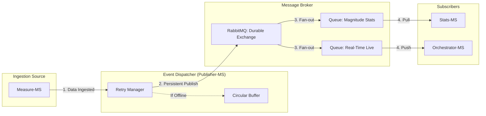

### 8.1 The AMQP Backbone
RabbitMQ provides a **Durable Exchange** ensuring guaranteed delivery.
*   **Durability**: Messages saved to disk to survive power loss.
*   **Acknowledgements**: Messages are only removed after successful processing.
*   **Scaling**: Publisher instances can be scaled horizontally to handle tens of thousands of simultaneous sensors.

### 8.2 The Publisher Logic
A lightweight Node.js worker listens for "data ingested" events.
1.  Connects with automatic retry logic.
2.  Serializes objects to Buffers.
3.  Publishes with `persistent: true`.
4.  **Circular Buffer**: Caches messages if the broker is unreachable, flushing them once connectivity is restored.

---

<a id="chapter-9"></a>
## 🎨 Chapter 9: Angular-MS — The Human Interface

The UI is a high-performance, reactive **Angular 15** application.

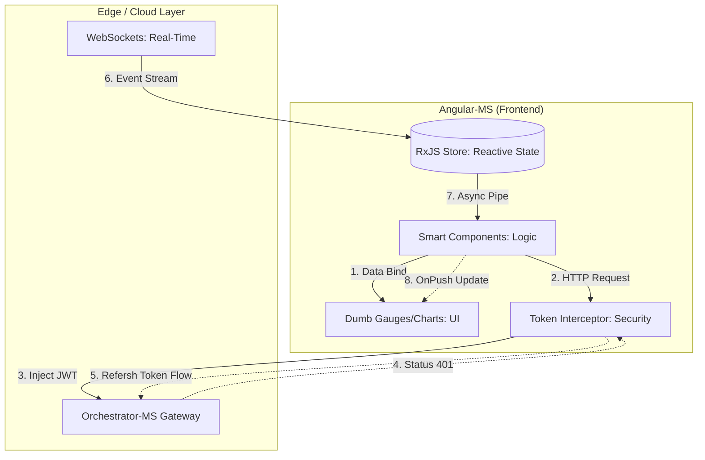

### 9.1 Architectural Patterns
We follow the **Smart/Dumb Component Pattern** and leverage **RxJS** for reactive data streams.
*   **OnPush Strategy**: Only re-renders specific gauges that receive new data.
*   **Theme**: Uses CSS Custom Properties for **Responsive Glassmorphism** (translucent cards with blur effects).

### 9.2 Security & The Token Interceptor
Every HTTP call is caught by the **TokenInterceptor**.
1.  **Inject**: Automatically adds JWT to the `Authorization` header.
2.  **Repair**: If a 401 occurs, it triggers the transparent refresh flow, injecting the new token and re-running the failed request without user interruption.

### 9.3 The Visualization Suite
*   **Ngx-Charts**: For historical trends.
*   **Custom SVG Gauges**: For real-time magnitude assessment.

---

<a id="chapter-10"></a>
## 🗄️ Chapter 10: The Persistence Layer — Polyglot Databases

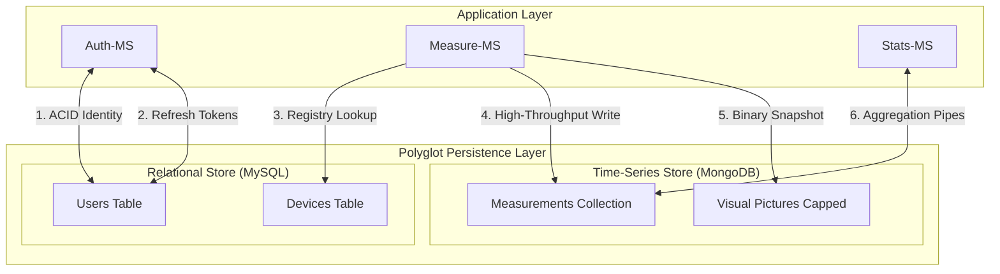

### 10.1 MySQL: Relational Integrity
Handles data requiring **Strict Relation** (Users, Device Registry).
*   **Normal Forms**: 3NF compliance.
*   **Registry Constraints**: CASCADE deletes ensure GDPR compliance by purging all device data when a user account is removed.

### 10.2 MongoDB: Time-Series Engine
Handles high-frequency readings.
*   **Indexes**: `timestamp: -1` and `{username: 1, ip: 1}` for microsecond query speeds.
*   **Sharding**: Prepared for massive scaling by distributing measurement documents across cluster nodes.

---

<a id="chapter-11"></a>
## ☸️ Chapter 11: Kubernetes: The Industrial Orchestrator

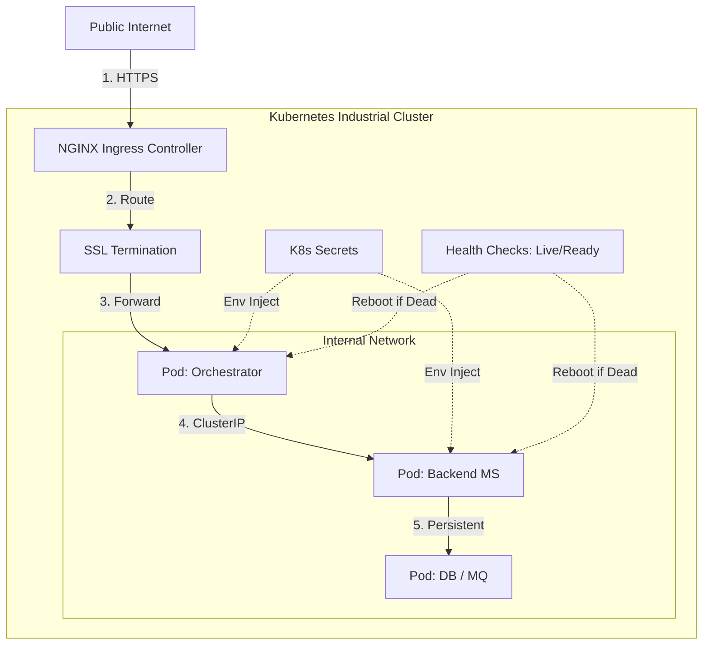

### 11.1 Declarative Infrastructure
Every service is defined by a manifest using **Rolling Update** strategies.
*   **Self-Healing**: Liveness and Readiness probes ensure traffic only reaches healthy pods.
*   **Resource Governance**: CPU and Memory quotas prevent rogue services from starving the cluster.

### 11.2 Networking & Secrets
*   **Ingress**: NGINX handles SSL termination and path-based routing.
*   **Secrets**: Mounted as environment variables via `secretKeyRef`, keeping credentials out of Git.

### 11.3 Google Cloud (GKE Autopilot) Migration
In March 2026, the project successfully transitioned from local Minikube development to **Google Kubernetes Engine (GKE) Autopilot** in the `europe-west1` (Belgium) region.

#### 11.3.1 Managed Node Governance
By leveraging Autopilot, we eliminated the overhead of node management. GKE automatically provisions, scales, and hardens the underlying VM nodes, allowing us to focus entirely on workload logic.

#### 11.3.2 Resource Right-Sizing
A critical lesson from the migration was the importance of **explicit resource requests**. Initial deployments without requests defaulted to 2vCPU/2GiB per pod, leading to a projected cost of ~$328/month. By right-sizing pods (e.g., `stats-ms` to 250m CPU and `fake-arduino` to 256Mi RAM), we reduced the projected cost to **$177/month**, a 46% efficiency gain.

#### 11.3.3 Automated End-to-End Infrastructure Deployment
To completely streamline the cloud provisioning and application delivery process, the `recreate_all_gcp.sh` script provides a single-command solution to orchestrate the entire deployment lifecycle from scratch.
1. **Provision GCP Infrastructure**: Re-creates the Artifact Registry and GKE Autopilot cluster via `setup_gcp_infra.sh`.
2. **Update Manifests**: Dynamically rewrites all Kubernetes Deployment YAML tags to point to the remote Artifact Registry.
3. **Trigger Cloud Builds**: Spawns concurrent Google Cloud Build jobs (`gcloud builds submit --async`) for all 10+ microservices simultaneously.
4. **Deploy K8s Configurations**: Applies Secrets and ConfigMaps first to ensure environments initialize correctly.
5. **Release Services**: Deploys the actual workloads. Pods natively utilize Kubernetes `ImagePullBackOff` resilience to gracefully wait for the asynchronous Cloud Builds to finish compiling before successfully spinning up.

---

<a id="chapter-12"></a>
## 🕵️ Chapter 12: Observability: Metrics, Logs, and Tracing

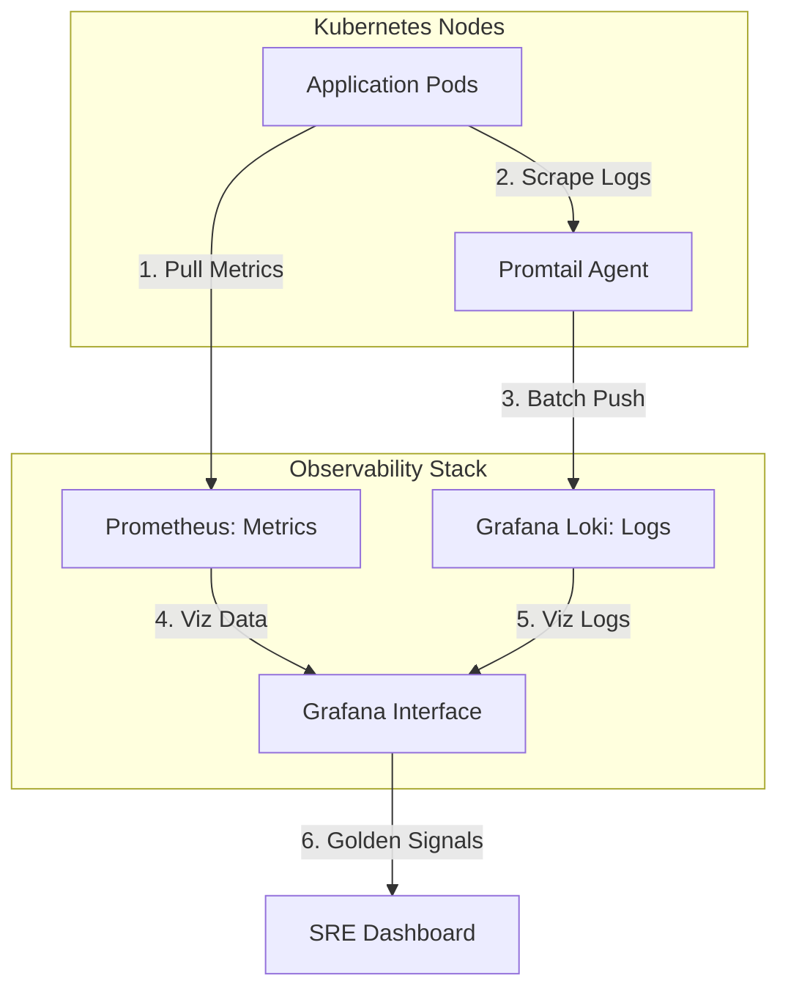

### 12.1 Prometheus & Grafana
We track the "Four Golden Signals": Latency, Traffic, Errors, and Saturation.
*   **Grafana Dashboards**: Combine infrastructure health with business metrics (e.g., "Sensors Online %").

### 12.2 Centralized Logging (Loki)
Logs are aggregated via Promtail. We correlate events across services using a `request_id` header, allowing us to trace a single user login through the Orchestrator, Auth, and MySQL pods.

---

<a id="chapter-13"></a>
## 🏗️ Chapter 13: Engineering Excellence: TDD & CI/CD

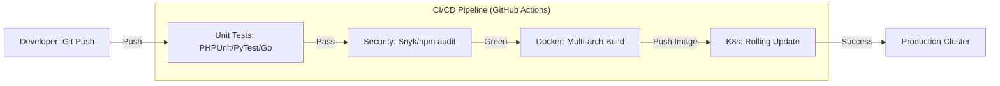

### 13.1 The Testing Pyramid & 100% Enforcement
*   **Unit Tests**: Go (sqlmock) and Python (unittest.mock).
*   **Integration Tests**: Using `Supertest` to verify internal API contracts.
*   **End-to-End**: **Cypress** verifies the full stack by simulating a browser user.

### 13.2 The "Strict 100%" Coverage Mandate
In March 2026, the project underwent a "Global Threshold Calibration" to enforce a **Hard 100% Coverage Rule**. 

*   **Node.js Enforcement**: Every `package.json` now contains a `jest.coverageThreshold` block requiring 100% for lines, branches, functions, and statements.
*   **Python Enforcement**: Services utilize `pytest --cov-fail-under=100` to reject partial coverage.
*   **Go Enforcement**: The `auth-ms` utilizes `go test -cover` with a custom script to ensure zero uncovered blocks.

### 13.3 Automated CI/CD Hard Blocks
The GitHub Actions pipeline has been upgraded from "Monitoring" to "Enforcement". 
1.  **Rejection on Push**: Any pull request that drops coverage by even 0.1% or fails to meet the 100% threshold is automatically rejected.
2.  **No-Merge Policy**: The main branch is protected; coverage must be proven via CI artifacts before a merge is authorized.
3.  **Local Git Hooks**: Developers utilize **Husky** and **lint-staged** to run tests locally before the commit is even allowed to leave the workstation.

### 13.4 Mutation Testing: Guarding against the "Survived Mutant"
Coverage metrics (100%) prove that every line was executed, but they do not prove that the tests are actually *checking* the logic. To solve this, we implemented **Mutation Testing**.

#### 13.4.1 StrykerJS for Node.js
We utilize **StrykerJS** for our core Javascript services (`orchestrator-ms`, `measure-ms`, `microcontrollers-ms`). Stryker modifies the source code (mutates it)—for example, changing a `>` to a `<` or a `true` to a `false`. 
*   **The Goal**: If a mutant is introduced, at least one test must fail (killing the mutant).
*   **The Result**: If all tests pass despite a code change, we have a "Survived Mutant," indicating a gap in our assertions.

#### 13.4.2 Mutmut for Python
For the analytical services (`stats-ms`, `ai-ms`), we utilize **Mutmut**. This tool specifically targets Python logic, ensuring that our analytical computations (like moving averages or LSTM data preparation) are rigorously verified beyond simple line coverage.

#### 13.4.3 The Mutation Score Mandate
Similar to line coverage, we track the **Mutation Score**. A high mutation score signifies that our test suite is not only comprehensive but also highly sensitive to logic regressions.

---

<a id="chapter-14"></a>
## 🤖 Chapter 14: The Simulation Layer: Fake Arduino IoT

How do you develop a massive IoT system without 1,000 physical Arduinos?

### 14.1 High-Fidelity Simulation
The `fake-arduino-iot` services simulate real-world physics.
*   **Random Walk**: Mimics natural temperature and humidity fluctuations.
*   **Failure Injection**: Simulates "Dying Sensors" and network brownouts for reliability testing.

---

<a id="chapter-15"></a>
## 🛠️ Chapter 15: Troubleshooting & Post-Mortems

### 15.1 Technical War Stories

#### 15.1.1 The Infinite Auth Loop
**Incident**: Users logged out every 10 seconds.
**Discovery**: 30-second clock skew between two nodes.
**Resolution**: Implemented skew tolerance and NTP synchronization.

#### 15.1.2 The "RabbitMQ Poison Pill"
**Incident**: `stats-ms` stuck in high CPU consumption.
**Discovery**: Malformed data re-queued infinitely.
**Resolution**: Implemented **Dead Letter Exchanges (DLX)** for isolation.

#### 15.1.3 The "OOM-Killed Python"
**Incident**: Pods crashing on large history requests.
**Discovery**: Loading 30 days of raw documents into RAM.
**Resolution**: Moved logic to **MongoDB Aggregation Pipelines**, reducing RAM usage by 99.9%.

#### 15.1.4 The "Node.js Time Machine"
**Incident**: Deployment failure on `Object.hasOwn`.
**Discovery**: Local Node 20 vs Container Node 16 version drift.
**Resolution**: Standardized on `node:lts-iron` (Node 20).

#### 15.1.5 The AI Training Blockade
**Incident**: Gateway timeouts when clicking "Train Model."
**Discovery**: Training is a CPU-intensive, synchronous block in Flask.
**Resolution**: Offloaded training to a background thread and implemented a status polling endpoint, preventing Gateway socket exhaustion.

#### 15.1.6 The Keras 3 Deserialization Paradox
**Incident**: `ai-ms` returned 500 errors during prediction after a successful training. 
**Discovery**: The transition to TensorFlow 2.15+ (Keras 3) introduced a rigid serialization check for HDF5 models. Loading the `.h5` model with default settings failed due to legacy metric structures.
**Resolution**: Modified `load_model` with `compile=False`. This allowed the weights to load into the LSTM architecture for inference while bypassing the broken compilation step.

#### 15.1.7 The Prediction Shape Mismatch
**Incident**: Predict requests crashed with "ValueError: Input 0 of layer 'lstm' is incompatible."
**Discovery**: The model was trained with a `look_back` of 10, but the prediction request sent the full 20-point historical window.
**Resolution**: Implemented automatic window slicing in the `DataProcessor.transform_input` method, ensuring the LSTM only receives the most recent N points required by its architecture.

#### 15.1.8 The Hidden Manifest Trap
**Incident**: After running the automation script to recreate the entire GCP environment, database pods (`mongo-0`, `mysql-0`) remained in a perpetual `Pending` state.
**Discovery**: The `recreate_all_gcp.sh` script used `kubectl apply -f manifests-k8s/config/`, which ignored the `pvc-k8s/` subdirectory where the PersistentVolumeClaims were defined. Without PVCs, the GKE scheduler could not bind storage to the database pods.
**Resolution**: Modified the deployment script to use the recursive flag (`kubectl apply -R -f manifests-k8s/config/`), ensuring every layer of configuration is applied regardless of folder depth.

#### 15.1.9 The MySQL Init Constraint
**Incident**: Although the `mysql-0` pod reached a `Running` state, it failed its readiness probe indefinitely, reporting `connection refused`.
**Discovery**: The container logs revealed an error during the initial database setup: `Column count doesn't match value count at row 1` in `initdb.sql`. The `INSERT` statement for the `microcontrollers` table was missing values for newer columns (`thresholdMin`, `thresholdMax`), causing the initialization to crash and restart the server process repeatedly.
**Resolution**: Updated `mysql-iot/initdb.sql` to use explicit column-specific `INSERT` statements, ensuring robustness against future schema additions.

---

<a id="chapter-16"></a>
## 🚀 Chapter 16: Technical Roadmap & Future Improvements

The IoT Microservices project is not a destination but a continuous journey of engineering evolution. This chapter outlines the high-level roadmap for the next phase of development.

### 16.1 The Edge Revolution: Distributed Processing
To handle 100x more devices, we must stop sending all raw data to the central cloud.

#### 16.1.1 WebAssembly (Wasm) at the Gateway
We will transition from a "Cloud-Only" ingestion model to a **Distributed Edge** architecture by deploying lightweight **Wasm** runtimes (using Wasmtime or Wasmer) on local IoT gateways (e.g., Raspberry Pi nodes).

**The Strategic Motivation:**
As the device fleet grows to thousands of sensors, the "Data Funnel" problem leads to high bandwidth costs and increased latency. By running Wasm "Workers" physically near the sensors, we achieve:

*   **Intelligent Data Pruning**: Wasm modules aggregate hundreds of raw signals (e.g., 60 individual 1-second readings) into a single 1-minute summary document, reducing cloud ingress traffic by up to 98%.
*   **Near-Zero Latency Reflexes**: Critical logic (like triggering an emergency shutdown if temperature exceeds a safety threshold) is executed locally in microseconds, independent of internet connectivity to the main Kubernetes cluster.
*   **Hardened Sandboxing**: Unlike raw scripts, Wasm provides memory-isolated execution. If a module crashes, it cannot compromise the gateway's host OS, ensuring system-level stability at the edge.
*   **Polyglot Efficiency**: Logic can be written in high-performance languages like Rust or Go, compiled to tiny `.wasm` binaries (< 100KB), and pushed over-the-air to the fleet instantly.

**Conceptual Edge Workflow:**
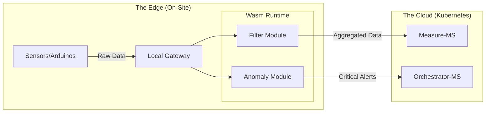

#### 16.1.2 Fog Computing Nodes: The Intermediate Intelligence Layer
The **Fog Layer** serves as the "Local Site Brain," providing coordination and resilience for entire physical locations (e.g., a greenhouse site or factory floor).

**The Hierarchy of Intelligence:**
*   **The Edge (Wasm Gateway)**: Micro-reflexes and pruning for small sensor clusters (Low-power, microsecond response).
*   **The Fog (Site Cluster)**: Site-wide coordination and survival logic (Medium-power, local database, offline resilience).
*   **The Cloud (K8s Cluster)**: Global analytics, identity management, and persistent history (High-power, cross-site patterns).

**Key Responsibilities of Fog Nodes:**
*   **Site Survival (Autonomous Ops)**: If the internet link fails, the Fog Node ensures the greenhouse remains operational, maintaining automation cycles and water control loops locally.
*   **Cross-Gateway Coordination**: While a Wasm Gateway only sees its own sensors, the Fog Node aggregates data from **all** onsite gateways to perform site-wide logic (e.g., closing all windows if any sensor detects high wind).
*   **Micro-AI Inference**: These nodes run dedicated TensorFlow Lite or ONNX models to detect complex anomalies locally (e.g., structural failure signatures) that require more compute than an Edge Gateway but more urgency than the Cloud.

**System Topology including Fog:**
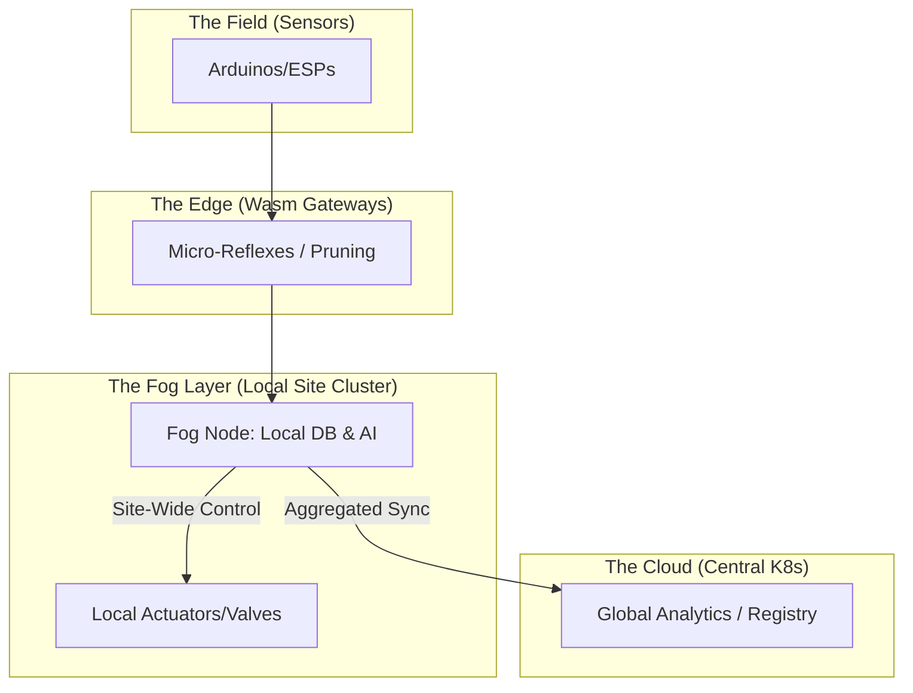

### 16.2 Zero-Trust Security & Sovereignty: Beyond the Castle Walls
In the current architecture, security is primarily perimeter-based. The next phase implements a **Zero-Trust** model: a strategic shift where no entity—internal or external—is trusted by default.

#### 16.2.1 Full Service Mesh (mTLS)
We will transition from plain-text internal communication to a **Service Mesh** (Istio or Linkerd) to eliminate the "Castle and Moat" vulnerability.
*   **Mutual TLS (mTLS)**: Every microservice pod is issued a unique cryptographic identity. Before any data exchange occurs (e.g., between `measure-ms` and `publisher-ms`), a mutual handshake verifies both identities.
*   **End-to-End Encryption**: All traffic within the Kubernetes cluster is encrypted. This prevents "Packet Sniffing" even if a single pod (like a vulnerable analytical service) is compromised.
*   **Automated Credential Rotation**: The service mesh handles the complexity of rotating thousands of certificates daily, ensuring that even if a secret is stolen, its utility is extremely short-lived.

#### 16.2.2 Data Sovereignty & Multi-Tenancy
To support global expansion and comply with regional regulations (GDPR, CCPA, PIPL), we will implement **Sovereign Sharding**.
*   **Physical Localization**: Using MongoDB **Zone Sharding**, telemetry data is physically stored on SSDs within the user's legal jurisdiction (e.g., EU sensors stay in European data centers).
*   **Encryption at Rest**: Every tenant's data is encrypted with a unique key managed by a Hardware Security Module (HSM). This ensures that even database administrators cannot access raw sensor data without the application-layer decryption key.

**Zero-Trust Security Topology:**
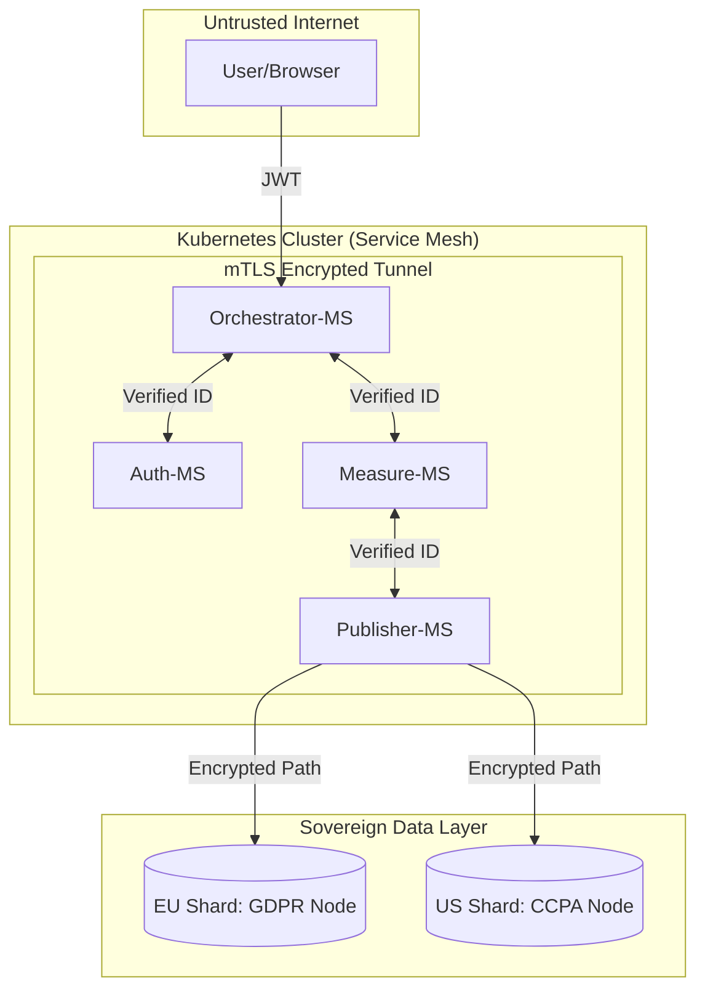

### 16.3 Infrastructure 4.0: The Global Mesh
The final stage of evolution is the transition from a single specialized cluster to a **Globally Federated Hive**. This architecture treats disparate cloud regions as a single, unified pool of resources.

#### 16.3.1 Cross-Cluster Replication (Cilium ClusterMesh)
To eliminate regional single points of failure, we will connect independent Kubernetes clusters in North America, Europe, and Asia.
*   **Global Service Discovery**: If a local instance of `auth-ms` is under heavy load, the Orchestrator can transparently route requests to a healthy cluster in another region via a high-speed private backbone.
*   **Active-Active Disaster Recovery**: In the event of a catastrophic regional outage, the global Anycast Load Balancer automatically redirects sensor traffic to the nearest healthy cluster, ensuring 99.999% availability.

#### 16.3.2 Serverless Offloading (Knative)
IoT workloads are characterized by unpredictable bursts (e.g., year-end reporting or sudden forensic audits). We will move from fixed-resource pods to **Knative Serverless** functions for high-compute tasks.
*   **Scale-to-Zero**: Analytical services like `stats-ms` will consume zero resources when idle, significantly reducing infrastructure costs.
*   **Rapid Horizontal Bursting**: Upon the arrival of a massive data window, Knative can spin up thousands of ephemeral pod instances in seconds, processing the burst and dissolving immediately after completion.

**Global Mesh Topology:**
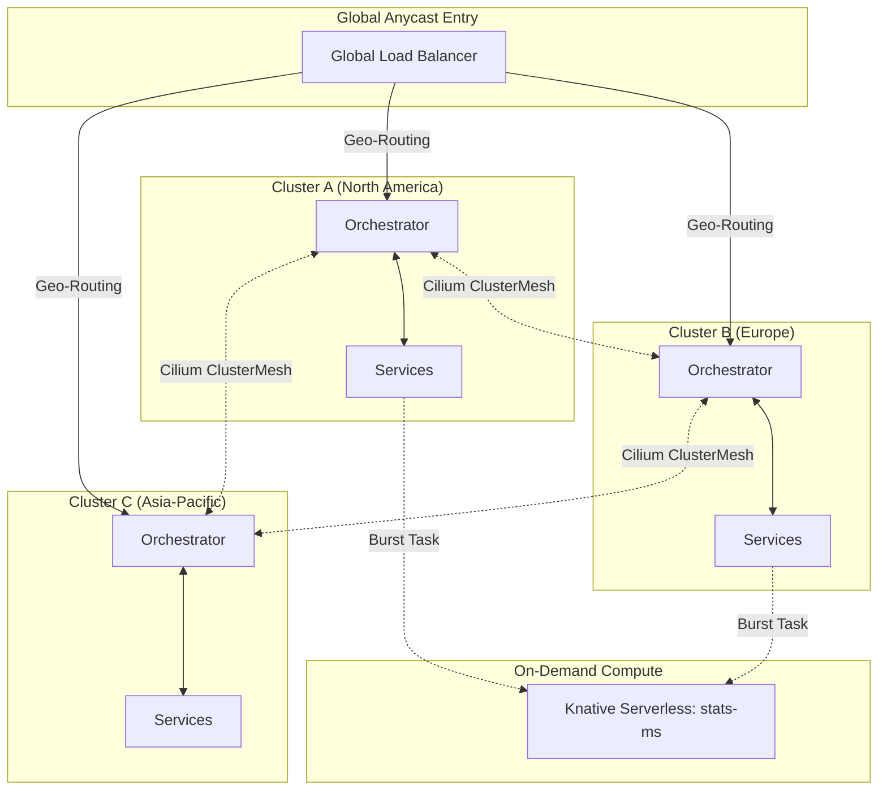

---

<a id="chapter-17"></a>
## 🗺️ Chapter 17: Strategic Roadmap — The Execution Plan

While the technical roadmap outlines **what** we will build, this chapter defines **when** and **how** we will execute these transitions to ensure zero downtime and maximum reliability.

### 17.1 Phase 1: Strict Enforcement & Baseline Prep (Completed)
The core infrastructure has been hardened with a "Zero-Tolerance" approach to tests.

*   **TDD Hard Block**: Successfully implemented across all 10+ microservices, ensuring 100% branch and line coverage as a prerequisite for CI/CD.
*   **Metric Unification**: Consolidation of Prometheus exporters to reduce resource overhead.
*   **GKE Migration**: Transitioned from Minikube to GKE Autopilot, achieving a 46% cost reduction via resource right-sizing ($177/mo).

### 17.2 Phase 2: Closing the Unit Gaps & Observability (In Progress)
The priority shifts to stabilizing the "Last Mile" of coverage and preparing for the Zero-Trust transition.

*   **mTLS Pilot**: Implement mutual TLS specifically for the `auth-ms` and `orchestrator-ms` path to harden identity services.
*   **Advanced Observability**: Integrate Grafana Loki and Prometheus metrics into a unified SRE dashboard.
*   **CI/CD Maturity**: Automate performance regression tests to detect latency spikes before deployment.

### 17.3 Phase 3: Edge Intelligence & Fog Deployment (Next 6 Months)
Focus shifts to the physical "Edge," reducing cloud ingestion costs and improving local reflexes.

*   **Wasm Ingestion Prototypes**: Deploy the first WebAssembly "Data Pruners" to select pilot greenhouse sites.
*   **Fog Node Integration**: Establish the first "Site Brains" to manage local database persistence (MongoDB Edge) and site-wide automation loops.
*   **Device Registry V2**: Upgrade `microcontrollers-ms` to handle device-to-gateway pairing and local discovery protocols.

### 17.4 Phase 4: Global Mesh & Infinite Scale (Next Year)
The final phase achieves global federation and serverless efficiency.

*   **Cross-Cluster Mesh**: Connect the EU and US clusters via Cilium ClusterMesh, enabling global identity sharing and failover.
*   **Serverless Offloading**: Migrate the heavy analytics functions in `stats-ms` to Knative, allowing the system to scale to zero during idle hours.
*   **Sovereign Sharding**: Implement jurisdiction-aware routing to ensure data residency compliance in real-time.

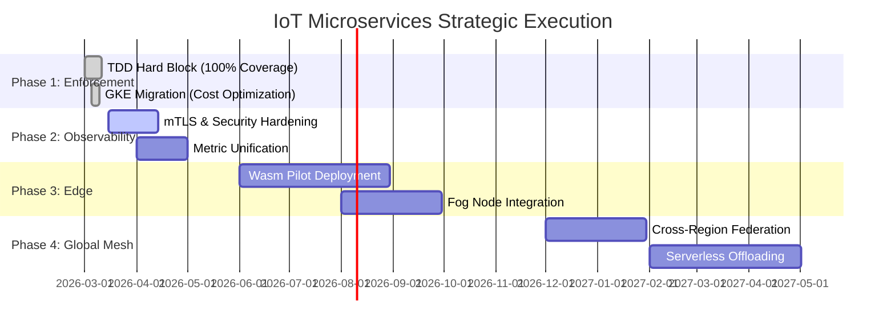

---

<a id="Appendix 1"></a>
## 🗺️ Appendix 1: Technical Concepts and Design Decisions
### Mutation Testing
**Mutmut** (often written as "mutmut") is **not** a specific feature, model, or component built directly into **TensorFlow** or artificial intelligence/machine learning frameworks. It's a standalone **Python tool** for **mutation testing** (also called mutation analysis).

In simple English:

- **What is mutation testing?**  
  It's an advanced way to check how good your **unit tests** really are. The tool automatically makes small, deliberate "bugs" (called **mutants**) in your code — for example:  
  - Change `+` to `-`  
  - Change `==` to `!=`  
  - Flip `True` to `False`  
  - Add/subtract 1 from a number  
  - Change a string slightly, etc.

- Then it runs your existing tests (like pytest or unittest).  
  - If a test **fails** because of the mutant → good! Your test caught the bug ("killed" the mutant).  
  - If the test **still passes** → bad! The mutant "survived" → your test didn't detect that change, meaning your tests might be weak or missing coverage for real bugs.

- **Mutmut** is one of the most popular and easy-to-use mutation testing tools for Python.  
  GitHub: https://github.com/boxed/mutmut  
  Docs: https://mutmut.readthedocs.io/

### Connection to TensorFlow / AI / Machine Learning?
There is **no direct "mutmut" thing in TensorFlow**. TensorFlow itself is a library for building and training neural networks (with operations that "mutate" tensors/state, but that's unrelated word usage).

However, people **do use mutmut** in ML/AI projects because:
- ML code is often Python-heavy (data loading, preprocessing, custom layers, loss functions, metrics, training loops, evaluation scripts).
- Small bugs in these parts (e.g., wrong normalization, flipped condition in augmentation, off-by-one in data splitting) can ruin model performance.
- Mutation testing helps ensure your unit tests for ML pipelines are strong, especially in research code or production ML systems where reliability matters.
- Some research papers and teams apply mutation testing (sometimes with mutmut or similar tools) to evaluate test quality for deep learning frameworks or models.

### Quick example of using mutmut
```bash
pip install mutmut
mutmut run  # runs mutation testing on your project (assumes pytest)
mutmut results  # shows survived/killed mutants
mutmut html     # generates a nice HTML report
```

In short:  
Mutmut = Python mutation testing tool → measures real strength of your tests.  
Useful for any Python project, including TensorFlow/Keras/PyTorch ML code, but **not** a TensorFlow-specific feature or AI model.

If this still isn't what you meant (maybe a typo for something else like "mu" in stats, or a different term?), feel free to give more context! 😊

**Mutation testing** is a powerful technique in software testing that goes beyond traditional metrics like code coverage. It evaluates the **true effectiveness** of your unit tests by introducing small, artificial faults (mutants) into the code and checking whether your tests detect ("kill") them.

Here are the main **benefits** of using mutation testing, based on established practices and real-world usage in 2026:

1. **Reveals weaknesses in your test suite that code coverage misses**  
   High code coverage (e.g., 90%+) can give false confidence. You might execute all lines/branches, but your tests could still miss subtle bugs. Mutation testing shows where tests fail to catch real logic errors — even tiny changes like flipping a condition or operator go undetected.

2. **Improves test quality and robustness**  
   By forcing developers to write tests that kill more mutants, the test suite becomes stronger and more reliable. Studies (e.g., ICSE 2021 research) show that teams using mutation testing over time write significantly better tests, with fewer surviving mutants in new changes.

3. **Better fault detection and higher confidence in catching real bugs**  
   Mutants are designed to mimic realistic programming mistakes. If your tests kill most mutants, they are more likely to catch actual faults. Real-world reports mention mutants preventing production outages or saving debugging hours by exposing uncovered logic.

4. **Encourages better code design and maintainability**  
   Developers often refactor code to make it more testable just to kill stubborn mutants. This leads to cleaner, less complex code with fewer hidden issues, reduced technical debt, and easier future changes.

5. **Makes code coverage more meaningful**  
   Mutation score (percentage of killed mutants) is a stronger quality indicator than plain line/branch coverage. Tools combine both for a realistic view of test health.

6. **Early bug detection and cost savings**  
   Issues are found during development rather than in production or late-stage testing. This reduces expensive fixes, rework, and downtime — teams report faster, more reliable deliveries.

7. **Developer learning and skill improvement**  
   Reviewing surviving mutants teaches developers how to write more effective assertions, edge cases, and boundary tests. It turns testing into a learning process.

8. **Particularly valuable in critical or complex domains**  
   In areas like machine learning pipelines, financial systems, safety-critical software, or large codebases, even small logic errors can have big impacts — mutation testing helps ensure tests are trustworthy.

### Quick Comparison Table

| Aspect                  | Traditional Code Coverage                  | Mutation Testing                              |
|-------------------------|--------------------------------------------|-----------------------------------------------|
| Measures                | Lines/branches executed                    | Ability to detect injected faults             |
| False confidence risk   | High (tests can pass without real checks)  | Low (surviving mutants highlight weaknesses)  |
| Actionable feedback     | Limited                                    | Very high (specific places to improve tests)  |
| Impact on test quality  | Moderate                                   | Strong (proven to lead to better tests over time) |

In practice (e.g., with tools like **mutmut**, **PIT**, **Stryker**, or **MuJava**), teams integrate it into CI/CD to gate merges or track mutation score trends. While it can be computationally expensive for very large projects, selective/parallel runs and modern optimizations make it feasible.

Overall, mutation testing is one of the best ways to move from "tests pass" to "I'm confident these tests actually protect the code." Many experienced teams consider it essential for high-quality, maintainable software — especially when reliability really matters.
### measure-ms implements Proactive Polling
The phrase **"measure-ms implements Proactive Polling"** describes a feature in a system (likely an IoT platform, edge gateway, or monitoring service) where latency or response time measurements—expressed in **milliseconds (ms)**—are performed using a **proactive polling** mechanism rather than purely reactive/event-driven approaches.

### What "Proactive Polling" Means in This Context
Proactive polling involves the system **actively and periodically querying** (or "polling") connected devices, sensors, user accounts, or registries at regular intervals to check status, fetch latest data, detect changes, or measure performance metrics. This contrasts with:
- **Passive/reactive** methods (e.g., devices push data via webhooks, MQTT subscriptions, or event triggers only when something changes).
- **Pure push-based** ingestion (common in high-throughput time-series setups).

Key benefits of proactive polling here:
- Ensures timely detection of issues (e.g., device offline, user session expired, registry inconsistency) even if the device doesn't initiate contact.
- Provides consistent, predictable measurement of round-trip times or health checks in **milliseconds** (e.g., "measure-ms" could refer to sub-second precision latency tracking during polls).
- Useful in scenarios requiring low-latency guarantees, heartbeat monitoring, or compliance with polling intervals (e.g., SIM/UICC proactive polling in mobile/IoT contexts, though adapted here to broader device/user management).

This complements earlier features:
- **High-throughput ingestion for time-series sensor data** → Handles bulk/append-heavy telemetry pushes.
- **ACID compliance for user accounts and device registries** → Ensures transactional integrity for polled/updated metadata.

### Typical Implementations Where This Fits
Systems that combine these often use proactive polling for **device health monitoring**, **liveness checks**, or **latency-aware operations** in IoT/cloud platforms:

- **Azure IoT Hub / Edge** — Supports configurable polling for device twins, direct methods, or cloud-to-device messaging. Proactive polling can measure response times in ms for commands/heartbeats, ensuring devices are reachable and measuring end-to-end latency.
- **AWS IoT Core / Greengrass** — Device shadows and jobs use polling-like mechanisms; custom rules or Lambda can implement proactive status checks with ms-precision timing for diagnostics.
- **Custom IoT Platforms (e.g., built on Kafka + TimescaleDB/PostgreSQL)** — A polling service (e.g., cron-like or event-loop) queries registries/devices periodically, records measure-ms (e.g., via Prometheus-style metrics or custom timestamps), and triggers alerts/actions if thresholds are exceeded.
- **Monitoring/Observability Tools** — Like Prometheus with blackbox exporters or synthetic monitoring that proactively pings endpoints/devices and records latencies in ms.

### Why Measure in Milliseconds?
- IoT/real-time apps demand sub-second responsiveness (e.g., industrial control loops <100ms, fleet management alerts <500ms).
- Proactive polling allows baselining normal latencies and detecting anomalies (e.g., sudden spikes indicating network issues or device overload).
- Often logged as time-series metrics themselves (e.g., `poll_latency_ms{device_id="abc"}`).

### Architecture Pattern Integrating All Three Features
1. **High-throughput ingestion** → Push-based (MQTT/Kafka) for sensor telemetry → Time-series DB (e.g., QuestDB, InfluxDB).
2. **ACID-protected user accounts & device registry** → Relational store (PostgreSQL/RDS) for consistent CRUD ops.
3. **Proactive polling for measure-ms** → A dedicated poller service queries the registry/devices at intervals (e.g., every 5–60s), measures round-trip time in ms, updates status/health flags atomically (via ACID txns), and optionally pushes latency metrics to the time-series store.

This hybrid approach balances massive scale (push ingestion) with reliability/consistency (ACID + proactive checks).

If this matches a specific product (e.g., a database, IoT SDK, or observability tool like a "measure-ms" feature in a vendor's docs), or you're comparing implementations (e.g., polling vs. push trade-offs, battery impact on devices), share more context for deeper analysis!

### provides ACID compliance for user accounts and device registries.

The phrase **"provides ACID compliance for user accounts and device registries"** refers to a system or service that ensures strong transactional guarantees (Atomicity, Consistency, Isolation, Durability) specifically for managing **user accounts** (e.g., authentication, roles, profiles) and **device registries** (e.g., IoT device identities, metadata, provisioning status, certificates). This is critical in secure, scalable platforms like IoT ecosystems, identity management systems, or full-stack application backends where concurrent operations (e.g., registering a new device while updating user permissions) must not lead to inconsistencies, partial failures, or race conditions.

In IoT and cloud architectures, user accounts often require ACID for operations like password changes, role assignments, or multi-factor setup, while device registries need it for atomic provisioning, certificate rotation, or state updates—preventing issues like duplicate device IDs or orphaned metadata during failures.

### Why ACID Matters Here
- **User accounts** involve sensitive data with strict consistency needs (e.g., no duplicate emails, atomic group membership changes).
- **Device registries** in IoT handle high-concurrency scenarios (fleet scaling, revocations) where partial updates could compromise security or cause orphaned devices.

Traditional time-series databases (optimized for append-only high-throughput writes) often relax ACID for performance, so this capability points to a relational or hybrid system integrated into an IoT/cloud platform.

### Leading Systems/Services That Provide This
Here are prominent options (as of 2026) that explicitly or effectively deliver ACID compliance for these workloads:

- **AWS IoT Core + Amazon DynamoDB / Amazon RDS**  
  AWS IoT Core includes a built-in **device registry** for managing device metadata, certificates, and policies. For ACID needs (e.g., atomic device-user associations or user account ops), pair it with Amazon RDS (PostgreSQL/MySQL) or Aurora for relational ACID storage of user accounts and extended registry data. DynamoDB offers eventual consistency by default but supports transactions for ACID-like ops on related items. AWS often recommends RDS for features needing full ACID guarantees in IoT architectures.

- **Azure IoT Hub + Azure SQL Database / Cosmos DB**  
  Azure IoT Hub provides a **device registry** (twin/state management). For ACID compliance on user accounts and linked registry data, use Azure SQL (full ACID relational) or Cosmos DB (multi-model with ACID transactions in single-document or cross-partition scopes). This combo supports secure, consistent management in enterprise IoT solutions.

- **Google Cloud IoT Core (legacy) / Device Registry in Cloud IoT + Cloud SQL / Firestore**  
  Google’s device registry handles provisioning and metadata. Pair with Cloud SQL (PostgreSQL/MySQL) for strong ACID on user accounts and registry linkages, or Firestore for document-based ACID transactions.

- **PostgreSQL / TimescaleDB (with relational extensions)**  
  As a relational database, PostgreSQL provides full ACID by default. In IoT setups, use it (or TimescaleDB for time-series + relational hybrid) to store both high-throughput sensor data and ACID-protected tables for user accounts and device registries (e.g., tables for devices, users, ownership mappings). This is common in self-managed or open-source IoT platforms needing strong guarantees.

- **MongoDB (with multi-document ACID transactions)**  
  Since version 4.0+, MongoDB supports ACID transactions across documents/collections—suitable for flexible schemas in device registries (JSON-like metadata) and user accounts. Popular in modern IoT backends where schema evolution is frequent.

- **Other enterprise options**  
  - **Actian Zen / Data Platform** — Emphasizes strong ACID for enterprise-grade integrity in mixed workloads.  
  - **Oracle / Microsoft SQL Server** — Classic full-ACID relational stores, used in regulated IoT/industrial setups for user/device management.  
  - **Fauna / YugabyteDB** — Distributed SQL/NewSQL databases offering ACID at scale, sometimes used for global IoT registries.

### Typical Architecture Pattern
1. **High-throughput sensor ingestion** → Time-series DB (e.g., InfluxDB, TimescaleDB, QuestDB) for metrics/telemetry.  
2. **User accounts & device registry** → ACID-compliant relational store (RDS, PostgreSQL, Azure SQL) for consistency-critical data.  
3. **Linkage** → Foreign keys, transactions, or event-driven sync (e.g., via Kafka) to associate users with devices atomically.  
4. **Security** → IAM/policies, encryption, and auditing layered on top.

This separation allows massive scale on time-series data while preserving ACID where it matters most (identity and registry ops).

If this is part of evaluating a specific platform (e.g., AWS IoT, Azure IoT, or an open-source stack), or you're comparing for a particular workload (e.g., regulatory compliance like HIPAA/PCI), let me know for more targeted details!

### provides high-throughput ingestion for time-series sensor data.
The phrase **"provides high-throughput ingestion for time-series sensor data"** describes a key feature or capability commonly found in specialized **time-series databases (TSDBs)**, streaming platforms, or data pipelines designed for IoT, industrial monitoring, telemetry, and sensor-heavy applications.

These systems must handle massive volumes of incoming data—often millions of points per second—from sensors (e.g., temperature, pressure, vibration, or location readings) without bottlenecks, backpressure, or data loss. This enables real-time or near-real-time analytics, anomaly detection, predictive maintenance, and monitoring.

### Common Technologies That Provide This Capability
Here are some of the leading options based on current (2026) usage patterns for high-throughput time-series sensor data ingestion:

- **Apache Kafka** — A distributed streaming platform widely used as the ingestion backbone. It excels at reliable, scalable, high-throughput data collection from sensors/IoT devices before routing to storage or processing layers. Often paired with time-series databases for end-to-end pipelines.

- **InfluxDB** — A purpose-built time-series database optimized for high write throughput, especially metrics and sensor/IoT data. It supports efficient ingestion of timestamped events and is popular in monitoring and observability.

- **TimescaleDB** (extension of PostgreSQL) — Offers high-performance ingestion for real-time sensor data in manufacturing, utilities, and IoT. It provides fast writes, automatic partitioning, and good SQL compatibility while scaling to high volumes.

- **QuestDB** — An open-source, high-performance TSDB engineered for ultra-fast ingestion (millions of rows/second) and low-latency queries. It's particularly strong for high-frequency sensor/telemetry data, financial time-series, and real-time analytics.

- **ClickHouse** (often via platforms like Tinybird) — Delivers extremely high ingestion rates for time-series workloads, with columnar storage optimized for append-heavy streams from sensors. Supports real-time SQL queries on live data.

- **Amazon Timestream** — A managed AWS service for time-series data, with built-in patterns for ingesting high-volume IoT/sensor streams (e.g., via AWS IoT Core or Greengrass).

- **MongoDB Time Series Collections** — Handles high-frequency IoT/sensor ingestion with optimized storage and automatic bucketing for time-based data.

- **CrateDB** — Supports high-velocity ingestion for mixed IoT/sensor workloads, with strong real-time analytics and search capabilities.

Other notable mentions include **kdb+** (for ultra-high-performance industrial/financial use cases) and **SurrealDB** (emerging multi-model option with efficient time-series support).

### Typical Architecture for High-Throughput Sensor Ingestion
1. **Sensors/Devices** → MQTT or direct protocols → Ingestion layer (e.g., Kafka or HTTP endpoints)
2. **High-throughput buffer/stream** (Kafka/Redpanda) → Processing (optional: Spark, Flink)
3. **Storage** → TSDB (QuestDB, TimescaleDB, InfluxDB, etc.) for compression, downsampling, and querying

If you're building or selecting a system for sensor data (e.g., IoT fleet, industrial equipment, environmental monitoring), prioritize:
- Ingestion rate (e.g., >1M points/sec sustained)
- Compression efficiency
- Query speed on recent + historical data
- Scalability and fault tolerance

Which specific use case or comparison are you looking into (e.g., open-source vs. managed, benchmarks, or integration with a particular stack)? I can dive deeper!

<a id="conclusion"></a>
## 🌅 Conclusion: The Horizon of IoT

The IoT Microservices project is a living ecosystem. By moving away from the "Big Ball of Mud" toward highly specialized reactors, we have built a **Resilient Backbone** for the future.

### The Road Ahead: 2026 and Beyond
1.  **Distributed Intelligence**: WebAssembly workers at the gateway level.
2.  **Global Mesh**: Cross-cluster federation for international fleets.
3.  **Autonomous Response**: Closing feedback loops at the Edge via Fog nodes.

---
*End of Volume I: The Engineering Manual.*
*Revised March 2026 (Post-100% TDD Enforcement).*
