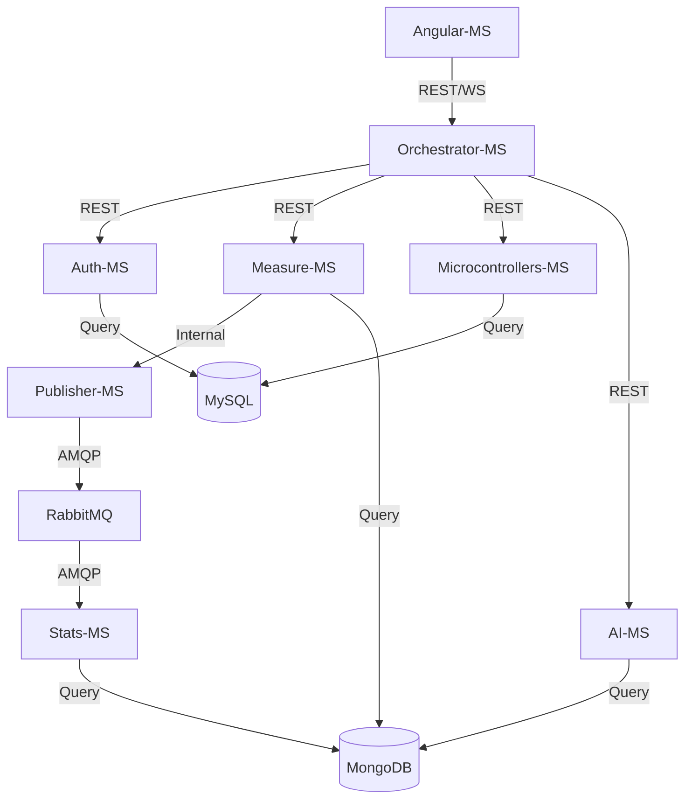

# 📘 THE IOT MICROSERVICES ENCYCLOPEDIA
## A Comprehensive Engineering Manifesto for Scalable IoT Systems

---

## 📜 Table of Contents

1.  **[Foreword: The IoT Revolution](#foreword)**
2.  **[Chapter 1: Architectural Philosophy](#chapter-1)**
3.  **[Chapter 2: Orchestrator-MS — The Central Nervous System](#chapter-2)**
4.  **[Chapter 3: Auth-MS — Identity in a Distributed World](#chapter-3)**
5.  **[Chapter 4: Measure-MS — Ingesting the Real World](#chapter-4)**
6.  **[Chapter 5: Microcontrollers-MS — The Device Registry](#chapter-5)**
7.  **[Chapter 6: Stats-MS — Intelligence from Chaos](#chapter-6)**
8.  **[Chapter 7: AI-MS — The Predictive Intelligence](#chapter-7)**
9.  **[Chapter 8: Publisher-MS & RabbitMQ — Seamless Message Flows](#chapter-8)**
10. **[Chapter 9: Angular-MS — The Human Interface](#chapter-9)**
11. **[Chapter 10: The Persistence Layer — Polyglot Databases](#chapter-10)**
12. **[Chapter 11: Kubernetes: The Industrial Orchestrator](#chapter-11)**
13. **[Chapter 12: Observability: Metrics, Logs, and Tracing](#chapter-12)**
14. **[Chapter 13: Engineering Excellence: TDD & CI/CD](#chapter-13)**
15. **[Chapter 14: The Simulation Layer: Fake Arduino IoT](#chapter-14)**
16. **[Chapter 15: Troubleshooting & Post-Mortems](#chapter-15)**
17. **[Chapter 16: Strategic Roadmap & Future Improvements](#chapter-16)**
18. **[Conclusion: The Horizon of IoT](#conclusion)**

---

<a name="foreword"></a>
## 🚀 Foreword: The IoT Revolution

In the next decade, an estimated 75 billion devices will be connected to the internet. This represents a data deluge of unprecedented proportions. Traditional, monolithic software architectures—once the bedrock of enterprise systems—are fundamentally ill-equipped to handle the erratic, high-volume, and geographically distributed nature of IoT data.

This engineering manifesto documents the **IoT Microservices Project**, a scalable, resilient, and polyglot ecosystem designed for the modern era. We move away from the "Big Ball of Mud" toward a modular, decoupled architecture where each service fulfills a specific, bounded context.

Our vision is simple: **Decoupled sensing, Centralized intelligence.** By the end of this volume, you will understand how to build a system that not only survives the IoT revolution but thrives within it.

---

<a name="chapter-1"></a>
## 🏛️ Chapter 1: Architectural Philosophy

The transition from a monolith to a microservices architecture is not merely a change in deployment; it is a fundamental shift in how we perceive software reliability and scalability.

### 1.1 The Pillars of the Architecture

#### 1.1.1 Fault Isolation (The Bulkhead Pattern)
In a monolithic system, a memory leak in the statistics module could crash the entire application, preventing users from even logging in. In our microservices architecture, we implement the **Bulkhead Pattern**. If `stats-ms` (Python) experiences a kernel panic while calculating complex Fourier transforms on sensor data, the `auth-ms` (Go) remains completely unaffected.

#### 1.1.2 Polyglot Persistence
We acknowledge that no single database is optimal for every workload. 
*   **Relational (MySQL)** provides ACID compliance for user accounts and device registries.
*   **Document (MongoDB)** provides high-throughput ingestion for time-series sensor data.

#### 1.1.3 Asynchronous Backpressure
By using **RabbitMQ**, we decouple the "Data Ingestion" (Measure-MS) from "Data Analysis" (Stats-MS). If the ingestion rate spikes suddenly, messages are safely queued in RabbitMQ, and the analysis engine processes them at its own sustainable pace, preventing system-wide cascading failures.

### 1.2 The Communication Matrix



#### 1.2.1 Service-to-Service Secret Authentication
While the browser authenticates via JWT, internal pod-to-pod communication carries an additional layer of security. We implement **Internal API Keys** passed in the `x-internal-api-key` header. This ensures that even if a pod in the `default` namespace is compromised, it cannot spoof measurements into `measure-ms` without the shared cluster secret.

#### 1.2.2 The State-Aware Gateway
The **Orchestrator-MS** maintains an ephemeral map of active WebSocket connections. When a message arrives from RabbitMQ, the Orchestrator performs a **User-Routing Lookup**. It identifies which connected browser "owns" the sensor that generated the data and emits the update *only* to that specific socket room. This prevents leaking sensitive sensor data to other users in a multi-tenant environment.

---

<a name="chapter-2"></a>
## 🧠 Chapter 2: Orchestrator-MS — The Central Nervous System

The `orchestrator-ms` is the gateway through which all digital reality passes. It is a Node.js application designed for asynchronous non-blocking I/O.

### 2.1 The Gateway Pattern & Responsibilities
The gateway acts as an **Identity-Aware Proxy** and the **Edge Gateway**. It is the first line of defense and the primary coordinator of all real-time flows.

#### 2.1.1 Request Aggregation & Identity
It does not trust the incoming headers from the browser. It reconstructs the requests for the backend services, pulling the `username` from the verified JWT payload. When the dashboard loads, the Orchestrator can aggregate data from `measure-ms`, `stats-ms`, and `microcontrollers-ms` into a single, unified response.

#### 2.1.2 Cross-Cutting Concerns
*   **Rate Limiting**: We use a sliding window algorithm via `express-rate-limit`.
    *   **/api/v1/auth/***: 5 requests per 15 minutes.
    *   **/api/v1/measures/***: 200 requests per 15 minutes.
*   **JWT Validation**: The Orchestrator decodes the JWT and verifies its signature for every request (except public routes).

### 2.2 Global Traffic Management Logic
The Gateway uses a consistent `ServicesController` to manage outbound requests with unified error handling:

```javascript
async postToConnectedService(res, service, path = '', body, status, returnResponse) {
  const url = `http://${service}/${path}`
  try {
    const response = await axios.post(url, body);
    return res.status(status).json(response.data);
  } catch (error) {
    return res.status(400).send("Service Communication Error");
  }
}
```

### 2.3 The WebSocket & Real-time Bridge
We utilize **Socket.io** to synchronize live updates. When `publisher-ms` sends a reading to RabbitMQ, the Orchestrator consumes from a dedicated queue and broadcasts to the specific user's socket room.
1.  `QueueManager` listens to RabbitMQ events.
2.  When a `measure_update` arrives, it broadcasts: `io.to(username).emit('measure_update', data);`
3.  This enables **Zero-Latency Visuals**.

---

<a name="chapter-3"></a>
## 🔐 Chapter 3: Auth-MS — Identity in a Distributed World

The `auth-ms` is a high-performance identity provider written in **Go**.

### 3.1 Why Go for Authentication?
In an IoT environment where thousands of devices might send "Check-in" heartbeats, the Authentication service is the most hit component. By using Go, we achieve:
*   **Minimal Memory Footprint**: Containers stay under 30MB of RAM.
*   **High Concurrency**: Lightweight goroutines handle thousands of simultaneous password verifications.

### 3.2 The Security Architecture

#### 3.2.1 Password Hashing Strategy
We utilize **SHA-256** for password hashing. The Orchestrator hashes the password before it reaches the internal network, ensuring "Pass-the-Hash" resilience.

#### 3.2.2 Token Lifecycle Management
*   **Access Token**: Signed JWT with `username` and `role` (10-minute TTL).
*   **Refresh Token**: Cryptographically random string stored in MySQL.
*   **Rotation Flow**: When a client requests a new access token, a **NEW** refresh token is issued, invalidating the old one. If an attacker steals a token, only one use is allowed before the sequence breaks.

### 3.3 The Data Access Object (DAO)
The Go DAO follows the **Repository Pattern**, allowing easy database swaps:
```go
type Repository interface {
	Exists(user model.User) (bool, model.User)
	Insert(user model.User) bool
	Update(credentials model.Credential) int64
}
```

---

<a name="chapter-4"></a>
## 🌡️ Chapter 4: Measure-MS — Ingesting the Real World

`measure-ms` represents the **Data Ingestion** layer.

### 4.1 The Proactive Polling Engine
Unlike systems that wait for push data, `measure-ms` implements **Proactive Polling**. This is crucial for hardware behind firewalls.
1.  **Trigger**: Cron-job or user request triggers `getMeasure`.
2.  **Resource Discovery**: Fetches registered devices from `microcontrollers-ms`.
3.  **Fan-out Probing**: Initiates parallel HTTP GET requests using `Promise.all`.
4.  **Error Handling**: Distinguishes between "Timeouts" (Device down) and "Invalid Response" (Hardware failing).

### 4.2 MongoDB Storage Strategy
Sensor data is write-heavy. We optimize MongoDB using **Compound Indexes** on `(username, ip, timestamp)`. 
*   **Capped Collections**: Used for buffering binary picture data to prevent disk exhaustion.
*   **Historical Data**: A bucket-based strategy stores years of sensor history efficiently.

### 4.3 The Picture Scheduler
The `picture.scheduler.js` manages periodic visual snapshots from IoT cameras (e.g., every 10 hours), providing a visual history without saturating the network with video streams.

---

<a name="chapter-5"></a>
## 📡 Chapter 5: Microcontrollers-MS — The Device Registry

This service handles the **Digital Twin Meta-Data** and inventory for every sensor in the field.

### 5.1 The Registration Protocol
Registering a new device requires its Magnitude, IP, and Port. The service performs a **pre-flight check** (pinging the IP:Port) before allowing the entry into the database to prevent "Ghost Devices."

### 5.2 The CRUD Pipeline & Integrity
We use MySQL for the registry because relational integrity is paramount.
*   **Integrity**: A device must be associated with exactly one user.
*   **IP Resolution**: Supports DNS names (like `living-room.local`), making it compatible with dynamic IP home networks.

---

<a name="chapter-6"></a>
## 📊 Chapter 6: Stats-MS — Intelligence from Chaos

`stats-ms` is the Python analytical service that handles **Refined Analytics**.

### 6.1 The Event-Driven Pipeline
The service is a **Consumer** in the RabbitMQ network, subscribing to magnitude queues.
1.  **Ingestion**: Receives JSON from RabbitMQ.
2.  **Validation**: Uses **Pydantic** models to ensure data quality (e.g., humidity 0-100%).
3.  **Computation**: Uses `Numpy` for lightning-fast array operations and rolling averages.

### 6.2 The Computational Intelligence
The service calculates:
*   **Moving Averages**: Smoothing sensor noise.
*   **Peak Detection**: Minimum/Maximum values over time windows.
*   **Anomalies**: Variance analysis to detect malfunctioning hardware.

---

<a name="chapter-7"></a>
## 🧠 Chapter 7: AI-MS — The Predictive Intelligence

The `ai-ms` represents the **Cognitive Layer** of the ecosystem, transitioning the project from reactive monitoring to proactive forecasting.

### 7.1 Deep Learning for Time-Series
Written in **Python** and powered by **TensorFlow 2.15**, this service implements **LSTM (Long Short-Term Memory)** neural networks to predict future sensor readings based on historical patterns.

#### 7.1.1 The Temporal Advantage
Unlike standard analytics, LSTMs maintain a "Cell State" (a long-term memory). This allows the system to understand that a temperature of 25°C at 6:00 AM (warming up) is fundamentally different from 25°C at 6:00 PM (cooling down), enabling precise frost or heatwave predictions hours in advance.

### 7.2 The Training & Inference Lifecycle
*   **Data Ingestion**: Pulls historical windows from MongoDB via a specialized ETL (Extract, Transform, Load) pipeline.
*   **Feature Scaling**: Implements **Min-Max Normalization** to ensure all sensor types (Humidity %, Temperature °C) exist on the same mathematical scale (0 to 1).
*   **Weights Persistence**: Serializes trained models in the `.h5` format, allowing for instant reload without re-training.

### 7.3 Integration with the Gateway
The `ai-ms` is isolated behind the Orchestrator. It exposes:
*   `/api/v1/ai/train`: Triggers an asynchronous training job for a specific device.
*   `/api/v1/ai/predict`: Returns a sequence of predicted values based on the latest telemetry buffer.

---

<a name="chapter-8"></a>
## ✉️ Chapter 8: Publisher-MS & RabbitMQ — Seamless Message Flows

The `publisher-ms` acts as an event-driven bridge using the **AMQP Protocol**.

### 7.1 The AMQP Backbone
RabbitMQ provides a **Durable Exchange** ensuring guaranteed delivery.
*   **Durability**: Messages saved to disk to survive power loss.
*   **Acknowledgements**: Messages are only removed after successful processing.
*   **Scaling**: Publisher instances can be scaled horizontally to handle tens of thousands of simultaneous sensors.

### 7.2 The Publisher Logic
A lightweight Node.js worker listens for "data ingested" events.
1.  Connects with automatic retry logic.
2.  Serializes objects to Buffers.
3.  Publishes with `persistent: true`.
4.  **Circular Buffer**: Caches messages if the broker is unreachable, flushing them once connectivity is restored.

---

<a name="chapter-9"></a>
## 🎨 Chapter 9: Angular-MS — The Human Interface

The UI is a high-performance, reactive **Angular 15** application.

### 8.1 Architectural Patterns
We follow the **Smart/Dumb Component Pattern** and leverage **RxJS** for reactive data streams.
*   **OnPush Strategy**: Only re-renders specific gauges that receive new data.
*   **Theme**: Uses CSS Custom Properties for **Responsive Glassmorphism** (translucent cards with blur effects).

### 8.2 Security & The Token Interceptor
Every HTTP call is caught by the **TokenInterceptor**.
1.  **Inject**: Automatically adds JWT to the `Authorization` header.
2.  **Repair**: If a 401 occurs, it triggers the transparent refresh flow, injecting the new token and re-running the failed request without user interruption.

### 8.3 The Visualization Suite
*   **Ngx-Charts**: For historical trends.
*   **Custom SVG Gauges**: For real-time magnitude assessment.

---

<a name="chapter-10"></a>
## 🗄️ Chapter 10: The Persistence Layer — Polyglot Databases

### 9.1 MySQL: Relational Integrity
Handles data requiring **Strict Relation** (Users, Device Registry).
*   **Normal Forms**: 3NF compliance.
*   **Registry Constraints**: CASCADE deletes ensure GDPR compliance by purging all device data when a user account is removed.

### 9.2 MongoDB: Time-Series Engine
Handles high-frequency readings.
*   **Indexes**: `timestamp: -1` and `{username: 1, ip: 1}` for microsecond query speeds.
*   **Sharding**: Prepared for massive scaling by distributing measurement documents across cluster nodes.

---

<a name="chapter-11"></a>
## ☸️ Chapter 11: Kubernetes: The Industrial Orchestrator

### 10.1 Declarative Infrastructure
Every service is defined by a manifest using **Rolling Update** strategies.
*   **Self-Healing**: Liveness and Readiness probes ensure traffic only reaches healthy pods.
*   **Resource Governance**: CPU and Memory quotas prevent rogue services from starving the cluster.

### 10.2 Networking & Secrets
*   **Ingress**: NGINX handles SSL termination and path-based routing.
*   **Secrets**: Mounted as environment variables via `secretKeyRef`, keeping credentials out of Git.

---

<a name="chapter-12"></a>
## 🕵️ Chapter 12: Observability: Metrics, Logs, and Tracing

### 11.1 Prometheus & Grafana
We track the "Four Golden Signals": Latency, Traffic, Errors, and Saturation.
*   **Grafana Dashboards**: Combine infrastructure health with business metrics (e.g., "Sensors Online %").

### 11.2 Centralized Logging (Loki)
Logs are aggregated via Promtail. We correlate events across services using a `request_id` header, allowing us to trace a single user login through the Orchestrator, Auth, and MySQL pods.

---

<a name="chapter-13"></a>
## 🏗️ Chapter 13: Engineering Excellence: TDD & CI/CD

### 12.1 The Testing Pyramid
*   **Unit Tests**: Go (sqlmock) and Python (unittest.mock).
*   **Integration Tests**: Using `Supertest` to verify internal API contracts.
*   **End-to-End**: **Cypress** verifies the full stack by simulating a browser user.

### 12.2 Automated Pipelines
GitHub Actions run linters, security scanners (NPM audit/Snyk), and build multi-arch Alpine-based Docker images on every push.

---

<a name="chapter-14"></a>
## 🤖 Chapter 14: The Simulation Layer: Fake Arduino IoT

How do you develop a massive IoT system without 1,000 physical Arduinos?

### 13.1 High-Fidelity Simulation
The `fake-arduino-iot` services simulate real-world physics.
*   **Random Walk**: Mimics natural temperature and humidity fluctuations.
*   **Failure Injection**: Simulates "Dying Sensors" and network brownouts for reliability testing.

---

<a name="chapter-15"></a>
## 🛠️ Chapter 15: Troubleshooting & Post-Mortems

### 15.1 Technical War Stories

#### 15.1.1 The Infinite Auth Loop
**Incident**: Users logged out every 10 seconds.
**Discovery**: 30-second clock skew between two nodes.
**Resolution**: Implemented skew tolerance and NTP synchronization.

#### 15.1.2 The "RabbitMQ Poison Pill"
**Incident**: `stats-ms` stuck in high CPU consumption.
**Discovery**: Malformed data re-queued infinitely.
**Resolution**: Implemented **Dead Letter Exchanges (DLX)** for isolation.

#### 15.1.3 The "OOM-Killed Python"
**Incident**: Pods crashing on large history requests.
**Discovery**: Loading 30 days of raw documents into RAM.
**Resolution**: Moved logic to **MongoDB Aggregation Pipelines**, reducing RAM usage by 99.9%.

#### 15.1.4 The "Node.js Time Machine"
**Incident**: Deployment failure on `Object.hasOwn`.
**Discovery**: Local Node 20 vs Container Node 16 version drift.
**Resolution**: Standardized on `node:lts-iron` (Node 20).

#### 15.1.5 The AI Training Blockade
**Incident**: Gateway timeouts when clicking "Train Model."
**Discovery**: Training is a CPU-intensive, synchronous block in Flask.
**Resolution**: Offloaded training to a background thread and implemented a status polling endpoint, preventing Gateway socket exhaustion.

---

<a name="chapter-16"></a>
## 🚀 Chapter 16: Strategic Roadmap & Future Improvements

The IoT Microservices project is not a destination but a continuous journey of engineering evolution. This chapter outlines the high-level roadmap for the next phase of development.

### 16.1 The Edge Revolution: Distributed Processing
To handle 100x more devices, we must stop sending all raw data to the central cloud.

#### 16.1.1 WebAssembly (Wasm) at the Gateway
We will deploy lightweight **Wasm** runtimes on local IoT gateways. These workers will perform "First-Pass Sanitization" and local aggregation.

#### 16.1.2 Fog Computing Nodes
Introducing an intermediate layer between the Arduinos and the Cloud. These "Fog Nodes" (dedicated onsite Raspberry Pi clusters) will handle real-time feedback loops locally.

### 16.2 Zero-Trust Security & Sovereignty
As the system scales, the "Castle-and-Moat" security model is no longer sufficient.

#### 16.2.1 Full Service Mesh (mTLS)
We will implement **Istio** or **Linkerd**. This will enforce **Mutual TLS (mTLS)** for every single pod-to-pod interaction.

#### 16.2.2 Data Sovereignty & Multi-Tenancy
To comply with global regulations (GDPR, CCPA), we will implement **Encrypted Sharding**. User data will be physically localized in the MongoDB cluster based on geographic region.

### 16.3 Infrastructure 4.0: The Global Mesh
The final stage is the transition from a single cluster to a **Federated Multi-Region Hive**.

#### 16.3.1 Cross-Cluster Replication
Using **Cilium ClusterMesh**, we will connect Kubernetes clusters in US, EU, and Asia.

#### 16.3.2 Serverless Offloading (Knative)
For high-burst analytical tasks, we will move from fixed `stats-ms` pods to **Knative Serverless functions**.

---

<a name="conclusion"></a>
## 🌅 Conclusion: The Horizon of IoT

The IoT Microservices project is a living ecosystem. By moving away from the "Big Ball of Mud" toward highly specialized reactors, we have built a **Resilient Backbone** for the future.

### The Road Ahead: 2026 and Beyond
1.  **Distributed Intelligence**: WebAssembly workers at the gateway level.
2.  **Global Mesh**: Cross-cluster federation for international fleets.
3.  **Autonomous Response**: Closing feedback loops at the Edge via Fog nodes.

---
*End of Volume I: The Engineering Manual.*
*Revised March 2026.*
