# 📘 THE IOT MICROSERVICES ENCYCLOPEDIA
## A Comprehensive Engineering Manifesto for Scalable IoT Systems

---

## 📜 Table of Contents

1.  **[Foreword: The IoT Revolution](#foreword)**
2.  **[Chapter 1: Architectural Philosophy](#chapter-1)**
3.  **[Chapter 2: Orchestrator-MS — The Central Nervous System](#chapter-2)**
4.  **[Chapter 3: Auth-MS — Identity in a Distributed World](#chapter-3)**
5.  **[Chapter 4: Measure-MS — Ingesting the Real World](#chapter-4)**
6.  **[Chapter 5: Microcontrollers-MS — The Device Registry](#chapter-5)**
7.  **[Chapter 6: Stats-MS — Intelligence from Chaos](#chapter-6)**
8.  **[Chapter 7: AI-MS — The Predictive Intelligence](#chapter-7)**
9.  **[Chapter 8: Publisher-MS & RabbitMQ — Seamless Message Flows](#chapter-8)**
10. **[Chapter 9: Angular-MS — The Human Interface](#chapter-9)**
11. **[Chapter 10: The Persistence Layer — Polyglot Databases](#chapter-10)**
12. **[Chapter 11: Kubernetes: The Industrial Orchestrator](#chapter-11)**
13. **[Chapter 12: Observability: Metrics, Logs, and Tracing](#chapter-12)**
14. **[Chapter 13: Engineering Excellence: TDD & CI/CD](#chapter-13)**
15. **[Chapter 14: The Simulation Layer: Fake Arduino IoT](#chapter-14)**
16. **[Chapter 15: Troubleshooting & Post-Mortems](#chapter-15)**
17. **[Chapter 16: Technical Roadmap & Future Improvements](#chapter-16)**
18. **[Chapter 17: Strategic Roadmap — The Execution Plan](#chapter-17)**
19. **[Conclusion: The Horizon of IoT](#conclusion)**

---

<a id="foreword"></a>
## 🚀 Foreword: The IoT Revolution

In the next decade, an estimated 75 billion devices will be connected to the internet. This represents a data deluge of unprecedented proportions. Traditional, monolithic software architectures—once the bedrock of enterprise systems—are fundamentally ill-equipped to handle the erratic, high-volume, and geographically distributed nature of IoT data.

This engineering manifesto documents the **IoT Microservices Project**, a scalable, resilient, and polyglot ecosystem designed for the modern era. We move away from the "Big Ball of Mud" toward a modular, decoupled architecture where each service fulfills a specific, bounded context.

Our vision is simple: **Decoupled sensing, Centralized intelligence.** By the end of this volume, you will understand how to build a system that not only survives the IoT revolution but thrives within it.

---

<a id="chapter-1"></a>
## 🏛️ Chapter 1: Architectural Philosophy

The transition from a monolith to a microservices architecture is not merely a change in deployment; it is a fundamental shift in how we perceive software reliability and scalability.

### 1.1 The Pillars of the Architecture

#### 1.1.1 Fault Isolation (The Bulkhead Pattern)
In a monolithic system, a memory leak in the statistics module could crash the entire application, preventing users from even logging in. In our microservices architecture, we implement the **Bulkhead Pattern**. If `stats-ms` (Python) experiences a kernel panic while calculating complex Fourier transforms on sensor data, the `auth-ms` (Go) remains completely unaffected.

#### 1.1.2 Polyglot Persistence
We acknowledge that no single database is optimal for every workload. 
*   **Relational (MySQL)** provides ACID compliance for user accounts and device registries.
*   **Document (MongoDB)** provides high-throughput ingestion for time-series sensor data.

#### 1.1.3 Asynchronous Backpressure
By using **RabbitMQ**, we decouple the "Data Ingestion" (Measure-MS) from "Data Analysis" (Stats-MS). If the ingestion rate spikes suddenly, messages are safely queued in RabbitMQ, and the analysis engine processes them at its own sustainable pace, preventing system-wide cascading failures.

### 1.2 The Communication Matrix

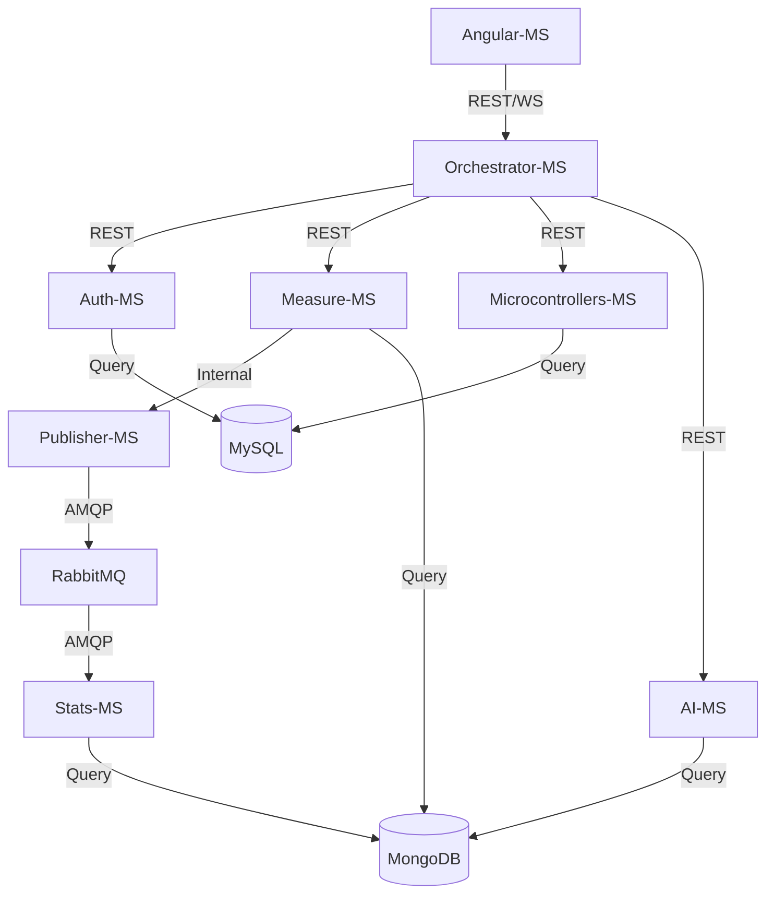

#### 1.2.1 Service-to-Service Secret Authentication
While the browser authenticates via JWT, internal pod-to-pod communication carries an additional layer of security. We implement **Internal API Keys** passed in the `x-internal-api-key` header. This ensures that even if a pod in the `default` namespace is compromised, it cannot spoof measurements into `measure-ms` without the shared cluster secret.

#### 1.2.2 The State-Aware Gateway
The **Orchestrator-MS** maintains an ephemeral map of active WebSocket connections. When a message arrives from RabbitMQ, the Orchestrator performs a **User-Routing Lookup**. It identifies which connected browser "owns" the sensor that generated the data and emits the update *only* to that specific socket room. This prevents leaking sensitive sensor data to other users in a multi-tenant environment.

---

<a id="chapter-2"></a>
## 🧠 Chapter 2: Orchestrator-MS — The Central Nervous System

The `orchestrator-ms` is the most critical service in the stack, acting as the **Identity-Aware Gateway** and the **Cognitive Hub** of the ecosystem. If the internal microservices are the organs, the Orchestrator is the nervous system that connects them and interacts with the external reality (the user's browser).

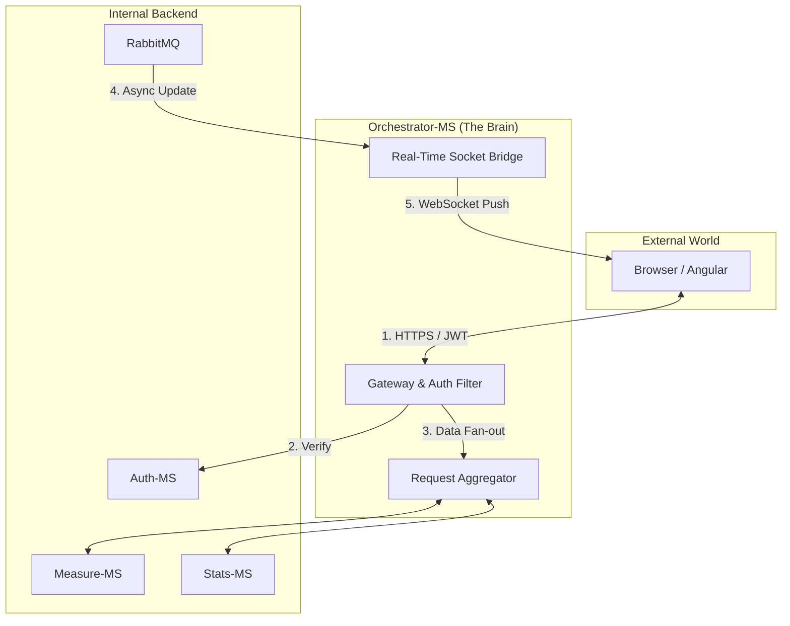

### 2.1 The Gateway Pattern & Edge Defense
The Orchestrator serves as the **Formal Entry Point** for all digital traffic. It implements the **Identity-Aware Proxy** pattern, ensuring that no request reaches the internal network without verification.
*   **Security Injection**: It validates the JWT from the browser, extracts the `username`, and injects it into internal requests. This allows backend services (like `measure-ms`) to remain "Auth-Agnostic," focusing purely on domain logic while inheriting security from the gateway.
*   **Cross-Cutting Concerns**: 
    *   **Rate Limiting**: Implements a sliding window via `express-rate-limit` (e.g., 5 auth attempts per 15 min) to thwart brute-force attacks.
    *   **JWT Validation**: Decodes and verifies signatures for every request, acting as the cluster's first line of defense.

### 2.2 Request Aggregation: The Great Unifier
When the dashboard initializes, it requires data from the **Registry** (`microcontrollers-ms`), **Current State** (`measure-ms`), and **Historical Trends** (`stats-ms`). The Orchestrator performs **Parallel Fan-out Queries**, aggregating these disparate JSON responses into a single, unified payload for the Angular frontend. This minimizes round-trip latency and simplifies frontend state management.

### 2.3 Global Traffic Management Logic
The Gateway utilizes a centralized `ServicesController` to manage outbound requests with consistent error handling and service discovery:

```javascript
async postToConnectedService(res, service, path = '', body, status, returnResponse) {
  const url = `http://${service}/${path}`
  try {
    const response = await axios.post(url, body);
    return res.status(status).json(response.data);
  } catch (error) {
    return res.status(400).send("Service Communication Error");
  }
}
```

### 2.4 The Real-Time Bridge (Socket.io)
We utilize **Socket.io** to synchronize the digital and physical worlds. The Orchestrator acts as a **RabbitMQ-to-WebSocket Bridge**:
1.  **Queue Monitoring**: Listens to RabbitMQ events emitted by `publisher-ms`.
2.  **User-Room Routing**: When a `measure_update` arrives, it identifies the "owner" and broadcasts specifically to that user’s socket room: `io.to(username).emit('measure_update', data);`
3.  **Zero-Latency Visuals**: This architecture ensures that the dashboard reflects physical sensor changes (like a temperature spike) in near-real-time without requiring a browser refresh.

### 2.5 Why Node.js?
Built on the **V8 Event Loop**, Node.js is uniquely suited for this role. It handles thousands of concurrent internal HTTP calls and long-lived WebSocket connections with a minimal memory footprint, ensuring the gateway remains non-blocking even under high telemetry load.

---

<a id="chapter-3"></a>
## 🔐 Chapter 3: Auth-MS — Identity in a Distributed World

The `auth-ms` is a high-performance identity provider written in **Go**.

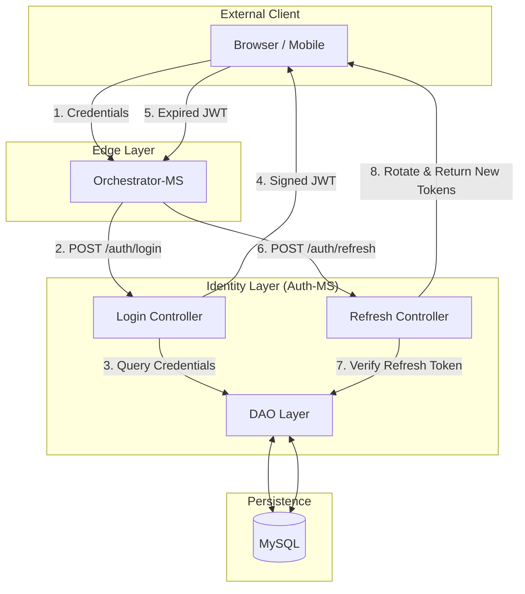

### 3.1 Why Go for Authentication?
In an IoT environment where thousands of devices might send "Check-in" heartbeats, the Authentication service is the most hit component. By using Go, we achieve:
*   **Minimal Memory Footprint**: Containers stay under 30MB of RAM.
*   **High Concurrency**: Lightweight goroutines handle thousands of simultaneous password verifications.

### 3.2 The Security Architecture

#### 3.2.1 Password Hashing Strategy
We utilize **SHA-256** for password hashing. The Orchestrator hashes the password before it reaches the internal network, ensuring "Pass-the-Hash" resilience.

#### 3.2.2 Token Lifecycle Management
*   **Access Token**: Signed JWT with `username` and `role` (10-minute TTL).
*   **Refresh Token**: Cryptographically random string stored in MySQL.
*   **Rotation Flow**: When a client requests a new access token, a **NEW** refresh token is issued, invalidating the old one. If an attacker steals a token, only one use is allowed before the sequence breaks.

### 3.3 The Data Access Object (DAO)
The Go DAO follows the **Repository Pattern**, allowing easy database swaps:
```go
type Repository interface {
	Exists(user model.User) (bool, model.User)
	Insert(user model.User) bool
	Update(credentials model.Credential) int64
}
```

---

<a id="chapter-4"></a>
## 🌡️ Chapter 4: Measure-MS — Ingesting the Real World

`measure-ms` represents the **Data Ingestion** layer.

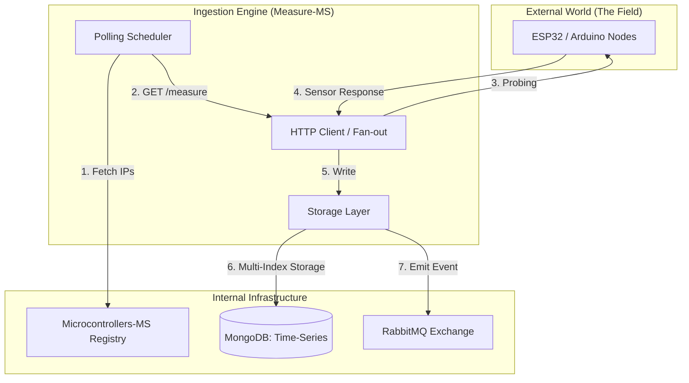

### 4.1 The Proactive Polling Engine
Unlike systems that wait for push data, `measure-ms` implements **Proactive Polling**. This is crucial for hardware behind firewalls.
1.  **Trigger**: Cron-job or user request triggers `getMeasure`.
2.  **Resource Discovery**: Fetches registered devices from `microcontrollers-ms`.
3.  **Fan-out Probing**: Initiates parallel HTTP GET requests using `Promise.all`.
4.  **Error Handling**: Distinguishes between "Timeouts" (Device down) and "Invalid Response" (Hardware failing).

### 4.2 MongoDB Storage Strategy
Sensor data is write-heavy. We optimize MongoDB using **Compound Indexes** on `(username, ip, timestamp)`. 
*   **Capped Collections**: Used for buffering binary picture data to prevent disk exhaustion.
*   **Historical Data**: A bucket-based strategy stores years of sensor history efficiently.

### 4.3 The Picture Scheduler
The `picture.scheduler.js` manages periodic visual snapshots from IoT cameras (e.g., every 10 hours), providing a visual history without saturating the network with video streams.

---

<a id="chapter-5"></a>
## 📡 Chapter 5: Microcontrollers-MS — The Device Registry

This service handles the **Digital Twin Meta-Data** and inventory for every sensor in the field.

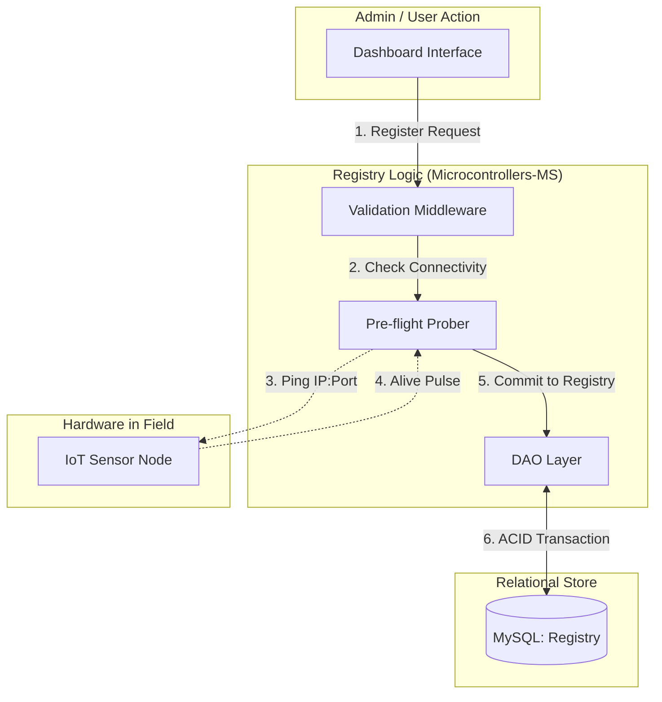

### 5.1 The Registration Protocol
Registering a new device requires its Magnitude, IP, and Port. The service performs a **pre-flight check** (pinging the IP:Port) before allowing the entry into the database to prevent "Ghost Devices."

### 5.2 The CRUD Pipeline & Integrity
We use MySQL for the registry because relational integrity is paramount.
*   **Integrity**: A device must be associated with exactly one user.
*   **IP Resolution**: Supports DNS names (like `living-room.local`), making it compatible with dynamic IP home networks.

---

<a id="chapter-6"></a>
## 📊 Chapter 6: Stats-MS — Intelligence from Chaos

`stats-ms` is the Python analytical service that handles **Refined Analytics**.

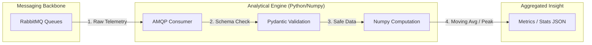

### 6.1 The Event-Driven Pipeline
The service is a **Consumer** in the RabbitMQ network, subscribing to magnitude queues.
1.  **Ingestion**: Receives JSON from RabbitMQ.
2.  **Validation**: Uses **Pydantic** models to ensure data quality (e.g., humidity 0-100%).
3.  **Computation**: Uses `Numpy` for lightning-fast array operations and rolling averages.

### 6.2 The Computational Intelligence
The service calculates:
*   **Moving Averages**: Smoothing sensor noise.
*   **Peak Detection**: Minimum/Maximum values over time windows.
*   **Anomalies**: Variance analysis to detect malfunctioning hardware.

---

<a id="chapter-7"></a>
## 🧠 Chapter 7: AI-MS — The Predictive Intelligence

The `ai-ms` represents the **Cognitive Layer** of the ecosystem, transitioning the project from reactive monitoring to proactive forecasting.

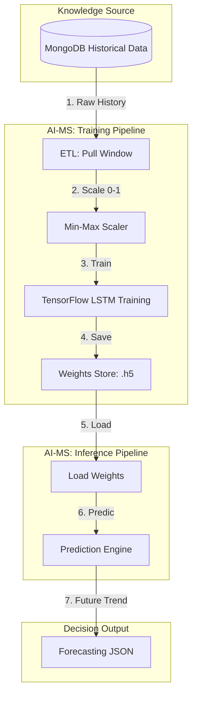

### 7.1 Deep Learning for Time-Series
Written in **Python** and powered by **TensorFlow 2.15**, this service implements **LSTM (Long Short-Term Memory)** neural networks to predict future sensor readings based on historical patterns.

#### 7.1.1 The Temporal Advantage
Unlike standard analytics, LSTMs maintain a "Cell State" (a long-term memory). This allows the system to understand that a temperature of 25°C at 6:00 AM (warming up) is fundamentally different from 25°C at 6:00 PM (cooling down), enabling precise frost or heatwave predictions hours in advance.

### 7.2 The Training & Inference Lifecycle
*   **Data Ingestion**: Pulls historical windows from MongoDB via a specialized ETL (Extract, Transform, Load) pipeline.
*   **Feature Scaling**: Implements **Min-Max Normalization** to ensure all sensor types (Humidity %, Temperature °C) exist on the same mathematical scale (0 to 1).
*   **Weights Persistence**: Serializes trained models in the `.h5` format, allowing for instant reload without re-training.

### 7.3 Integration with the Gateway
The `ai-ms` is isolated behind the Orchestrator. It exposes:
*   `/api/v1/ai/train`: Triggers an asynchronous training job for a specific device.
*   `/api/v1/ai/predict`: Returns a sequence of predicted values based on the latest telemetry buffer.

---

<a id="chapter-8"></a>
## ✉️ Chapter 8: Publisher-MS & RabbitMQ — Seamless Message Flows

The `publisher-ms` acts as an event-driven bridge using the **AMQP Protocol**.

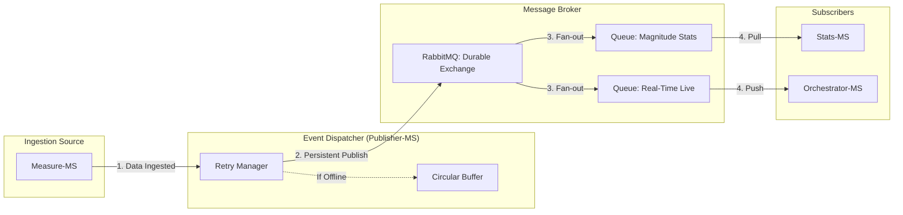

### 8.1 The AMQP Backbone
RabbitMQ provides a **Durable Exchange** ensuring guaranteed delivery.
*   **Durability**: Messages saved to disk to survive power loss.
*   **Acknowledgements**: Messages are only removed after successful processing.
*   **Scaling**: Publisher instances can be scaled horizontally to handle tens of thousands of simultaneous sensors.

### 8.2 The Publisher Logic
A lightweight Node.js worker listens for "data ingested" events.
1.  Connects with automatic retry logic.
2.  Serializes objects to Buffers.
3.  Publishes with `persistent: true`.
4.  **Circular Buffer**: Caches messages if the broker is unreachable, flushing them once connectivity is restored.

---

<a id="chapter-9"></a>
## 🎨 Chapter 9: Angular-MS — The Human Interface

The UI is a high-performance, reactive **Angular 15** application.

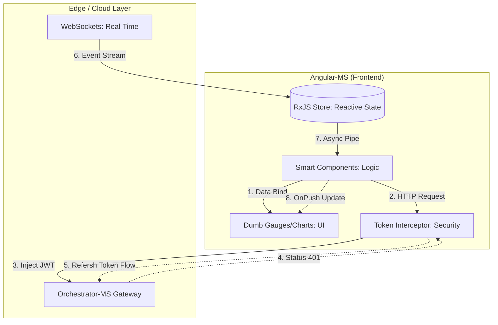

### 9.1 Architectural Patterns
We follow the **Smart/Dumb Component Pattern** and leverage **RxJS** for reactive data streams.
*   **OnPush Strategy**: Only re-renders specific gauges that receive new data.
*   **Theme**: Uses CSS Custom Properties for **Responsive Glassmorphism** (translucent cards with blur effects).

### 9.2 Security & The Token Interceptor
Every HTTP call is caught by the **TokenInterceptor**.
1.  **Inject**: Automatically adds JWT to the `Authorization` header.
2.  **Repair**: If a 401 occurs, it triggers the transparent refresh flow, injecting the new token and re-running the failed request without user interruption.

### 9.3 The Visualization Suite
*   **Ngx-Charts**: For historical trends.
*   **Custom SVG Gauges**: For real-time magnitude assessment.

---

<a id="chapter-10"></a>
## 🗄️ Chapter 10: The Persistence Layer — Polyglot Databases

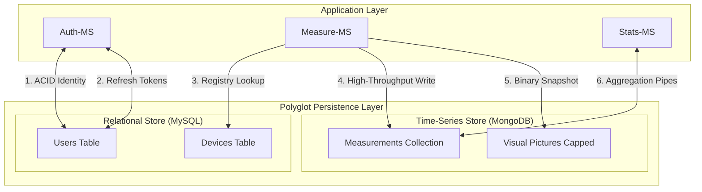

### 10.1 MySQL: Relational Integrity
Handles data requiring **Strict Relation** (Users, Device Registry).
*   **Normal Forms**: 3NF compliance.
*   **Registry Constraints**: CASCADE deletes ensure GDPR compliance by purging all device data when a user account is removed.

### 10.2 MongoDB: Time-Series Engine
Handles high-frequency readings.
*   **Indexes**: `timestamp: -1` and `{username: 1, ip: 1}` for microsecond query speeds.
*   **Sharding**: Prepared for massive scaling by distributing measurement documents across cluster nodes.

---

<a id="chapter-11"></a>
## ☸️ Chapter 11: Kubernetes: The Industrial Orchestrator

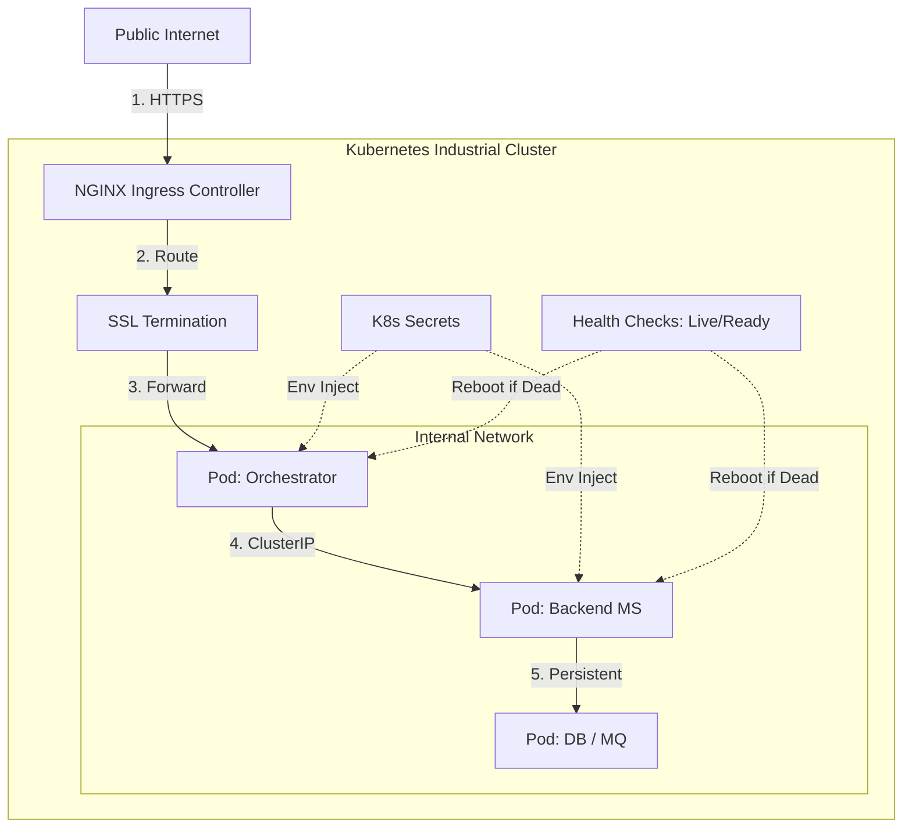

### 11.1 Declarative Infrastructure
Every service is defined by a manifest using **Rolling Update** strategies.
*   **Self-Healing**: Liveness and Readiness probes ensure traffic only reaches healthy pods.
*   **Resource Governance**: CPU and Memory quotas prevent rogue services from starving the cluster.

### 11.2 Networking & Secrets
*   **Ingress**: NGINX handles SSL termination and path-based routing.
*   **Secrets**: Mounted as environment variables via `secretKeyRef`, keeping credentials out of Git.

---

<a id="chapter-12"></a>
## 🕵️ Chapter 12: Observability: Metrics, Logs, and Tracing

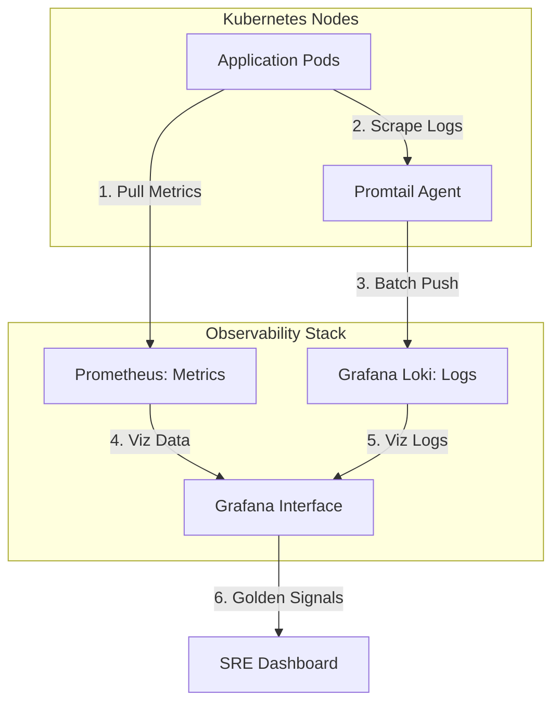

### 12.1 Prometheus & Grafana
We track the "Four Golden Signals": Latency, Traffic, Errors, and Saturation.
*   **Grafana Dashboards**: Combine infrastructure health with business metrics (e.g., "Sensors Online %").

### 12.2 Centralized Logging (Loki)
Logs are aggregated via Promtail. We correlate events across services using a `request_id` header, allowing us to trace a single user login through the Orchestrator, Auth, and MySQL pods.

---

<a id="chapter-13"></a>
## 🏗️ Chapter 13: Engineering Excellence: TDD & CI/CD

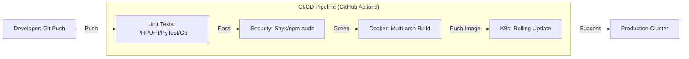

### 13.1 The Testing Pyramid
*   **Unit Tests**: Go (sqlmock) and Python (unittest.mock).
*   **Integration Tests**: Using `Supertest` to verify internal API contracts.
*   **End-to-End**: **Cypress** verifies the full stack by simulating a browser user.

### 13.2 Automated Pipelines
GitHub Actions run linters, security scanners (NPM audit/Snyk), and build multi-arch Alpine-based Docker images on every push.

---

<a id="chapter-14"></a>
## 🤖 Chapter 14: The Simulation Layer: Fake Arduino IoT

How do you develop a massive IoT system without 1,000 physical Arduinos?

### 14.1 High-Fidelity Simulation
The `fake-arduino-iot` services simulate real-world physics.
*   **Random Walk**: Mimics natural temperature and humidity fluctuations.
*   **Failure Injection**: Simulates "Dying Sensors" and network brownouts for reliability testing.

---

<a id="chapter-15"></a>
## 🛠️ Chapter 15: Troubleshooting & Post-Mortems

### 15.1 Technical War Stories

#### 15.1.1 The Infinite Auth Loop
**Incident**: Users logged out every 10 seconds.
**Discovery**: 30-second clock skew between two nodes.
**Resolution**: Implemented skew tolerance and NTP synchronization.

#### 15.1.2 The "RabbitMQ Poison Pill"
**Incident**: `stats-ms` stuck in high CPU consumption.
**Discovery**: Malformed data re-queued infinitely.
**Resolution**: Implemented **Dead Letter Exchanges (DLX)** for isolation.

#### 15.1.3 The "OOM-Killed Python"
**Incident**: Pods crashing on large history requests.
**Discovery**: Loading 30 days of raw documents into RAM.
**Resolution**: Moved logic to **MongoDB Aggregation Pipelines**, reducing RAM usage by 99.9%.

#### 15.1.4 The "Node.js Time Machine"
**Incident**: Deployment failure on `Object.hasOwn`.
**Discovery**: Local Node 20 vs Container Node 16 version drift.
**Resolution**: Standardized on `node:lts-iron` (Node 20).

#### 15.1.5 The AI Training Blockade
**Incident**: Gateway timeouts when clicking "Train Model."
**Discovery**: Training is a CPU-intensive, synchronous block in Flask.
**Resolution**: Offloaded training to a background thread and implemented a status polling endpoint, preventing Gateway socket exhaustion.

---

<a id="chapter-16"></a>
## 🚀 Chapter 16: Technical Roadmap & Future Improvements

The IoT Microservices project is not a destination but a continuous journey of engineering evolution. This chapter outlines the high-level roadmap for the next phase of development.

### 16.1 The Edge Revolution: Distributed Processing
To handle 100x more devices, we must stop sending all raw data to the central cloud.

#### 16.1.1 WebAssembly (Wasm) at the Gateway
We will transition from a "Cloud-Only" ingestion model to a **Distributed Edge** architecture by deploying lightweight **Wasm** runtimes (using Wasmtime or Wasmer) on local IoT gateways (e.g., Raspberry Pi nodes).

**The Strategic Motivation:**
As the device fleet grows to thousands of sensors, the "Data Funnel" problem leads to high bandwidth costs and increased latency. By running Wasm "Workers" physically near the sensors, we achieve:

*   **Intelligent Data Pruning**: Wasm modules aggregate hundreds of raw signals (e.g., 60 individual 1-second readings) into a single 1-minute summary document, reducing cloud ingress traffic by up to 98%.
*   **Near-Zero Latency Reflexes**: Critical logic (like triggering an emergency shutdown if temperature exceeds a safety threshold) is executed locally in microseconds, independent of internet connectivity to the main Kubernetes cluster.
*   **Hardened Sandboxing**: Unlike raw scripts, Wasm provides memory-isolated execution. If a module crashes, it cannot compromise the gateway's host OS, ensuring system-level stability at the edge.
*   **Polyglot Efficiency**: Logic can be written in high-performance languages like Rust or Go, compiled to tiny `.wasm` binaries (< 100KB), and pushed over-the-air to the fleet instantly.

**Conceptual Edge Workflow:**
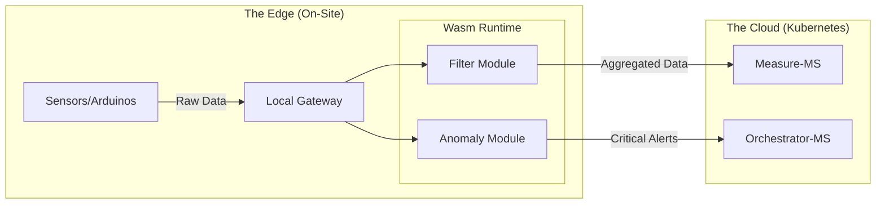

#### 16.1.2 Fog Computing Nodes: The Intermediate Intelligence Layer
The **Fog Layer** serves as the "Local Site Brain," providing coordination and resilience for entire physical locations (e.g., a greenhouse site or factory floor).

**The Hierarchy of Intelligence:**
*   **The Edge (Wasm Gateway)**: Micro-reflexes and pruning for small sensor clusters (Low-power, microsecond response).
*   **The Fog (Site Cluster)**: Site-wide coordination and survival logic (Medium-power, local database, offline resilience).
*   **The Cloud (K8s Cluster)**: Global analytics, identity management, and persistent history (High-power, cross-site patterns).

**Key Responsibilities of Fog Nodes:**
*   **Site Survival (Autonomous Ops)**: If the internet link fails, the Fog Node ensures the greenhouse remains operational, maintaining automation cycles and water control loops locally.
*   **Cross-Gateway Coordination**: While a Wasm Gateway only sees its own sensors, the Fog Node aggregates data from **all** onsite gateways to perform site-wide logic (e.g., closing all windows if any sensor detects high wind).
*   **Micro-AI Inference**: These nodes run dedicated TensorFlow Lite or ONNX models to detect complex anomalies locally (e.g., structural failure signatures) that require more compute than an Edge Gateway but more urgency than the Cloud.

**System Topology including Fog:**
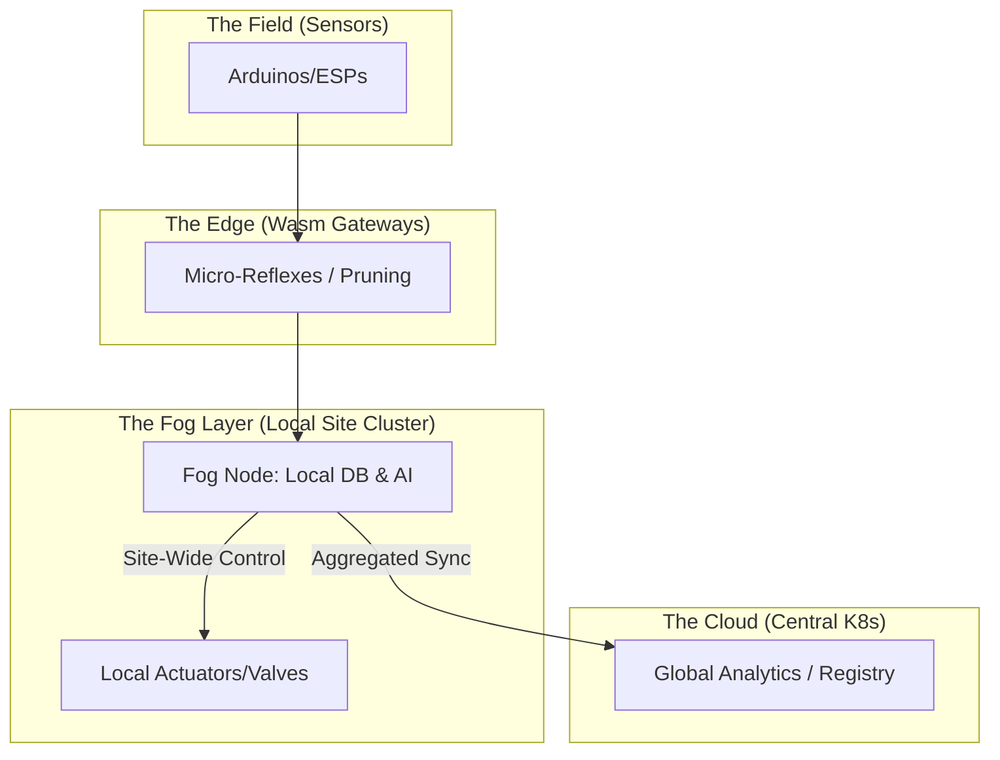

### 16.2 Zero-Trust Security & Sovereignty: Beyond the Castle Walls
In the current architecture, security is primarily perimeter-based. The next phase implements a **Zero-Trust** model: a strategic shift where no entity—internal or external—is trusted by default.

#### 16.2.1 Full Service Mesh (mTLS)
We will transition from plain-text internal communication to a **Service Mesh** (Istio or Linkerd) to eliminate the "Castle and Moat" vulnerability.
*   **Mutual TLS (mTLS)**: Every microservice pod is issued a unique cryptographic identity. Before any data exchange occurs (e.g., between `measure-ms` and `publisher-ms`), a mutual handshake verifies both identities.
*   **End-to-End Encryption**: All traffic within the Kubernetes cluster is encrypted. This prevents "Packet Sniffing" even if a single pod (like a vulnerable analytical service) is compromised.
*   **Automated Credential Rotation**: The service mesh handles the complexity of rotating thousands of certificates daily, ensuring that even if a secret is stolen, its utility is extremely short-lived.

#### 16.2.2 Data Sovereignty & Multi-Tenancy
To support global expansion and comply with regional regulations (GDPR, CCPA, PIPL), we will implement **Sovereign Sharding**.
*   **Physical Localization**: Using MongoDB **Zone Sharding**, telemetry data is physically stored on SSDs within the user's legal jurisdiction (e.g., EU sensors stay in European data centers).
*   **Encryption at Rest**: Every tenant's data is encrypted with a unique key managed by a Hardware Security Module (HSM). This ensures that even database administrators cannot access raw sensor data without the application-layer decryption key.

**Zero-Trust Security Topology:**
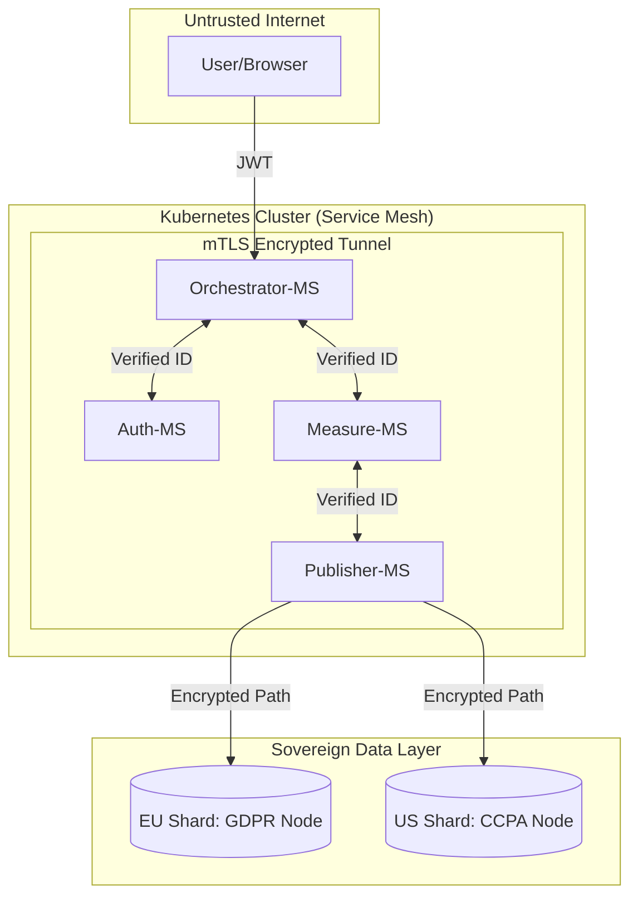

### 16.3 Infrastructure 4.0: The Global Mesh
The final stage of evolution is the transition from a single specialized cluster to a **Globally Federated Hive**. This architecture treats disparate cloud regions as a single, unified pool of resources.

#### 16.3.1 Cross-Cluster Replication (Cilium ClusterMesh)
To eliminate regional single points of failure, we will connect independent Kubernetes clusters in North America, Europe, and Asia.
*   **Global Service Discovery**: If a local instance of `auth-ms` is under heavy load, the Orchestrator can transparently route requests to a healthy cluster in another region via a high-speed private backbone.
*   **Active-Active Disaster Recovery**: In the event of a catastrophic regional outage, the global Anycast Load Balancer automatically redirects sensor traffic to the nearest healthy cluster, ensuring 99.999% availability.

#### 16.3.2 Serverless Offloading (Knative)
IoT workloads are characterized by unpredictable bursts (e.g., year-end reporting or sudden forensic audits). We will move from fixed-resource pods to **Knative Serverless** functions for high-compute tasks.
*   **Scale-to-Zero**: Analytical services like `stats-ms` will consume zero resources when idle, significantly reducing infrastructure costs.
*   **Rapid Horizontal Bursting**: Upon the arrival of a massive data window, Knative can spin up thousands of ephemeral pod instances in seconds, processing the burst and dissolving immediately after completion.

**Global Mesh Topology:**
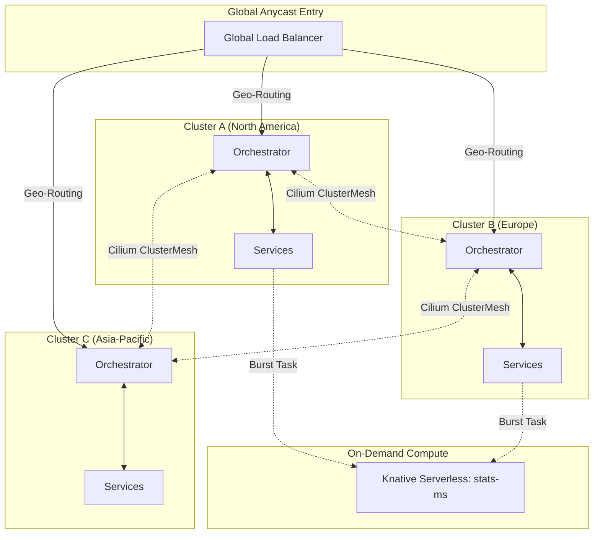

---

<a id="chapter-17"></a>
## 🗺️ Chapter 17: Strategic Roadmap — The Execution Plan

While the technical roadmap outlines **what** we will build, this chapter defines **when** and **how** we will execute these transitions to ensure zero downtime and maximum reliability.

### 17.1 Phase 1: The Observability & Security Hardening (Current Quarter)
The priority is to stabilize the existing cluster and prepare for the transition to a Zero-Trust environment.

*   **Metric Unification**: Consolidate disparate Prometheus exporters into a unified scraping service to reduce resource overhead.
*   **mTLS Pilot**: Implement mutual TLS specifically for the `auth-ms` and `orchestrator-ms` path to harden identity services.
*   **CI/CD Maturity**: Automate performance regression tests in the Jenkins/GitHub Actions pipeline to detect latency spikes before deployment.

### 17.2 Phase 2: Edge Intelligence & Fog Deployment (Next 6 Months)
Focus shifts to the physical "Edge," reducing cloud ingestion costs and improving local reflexes.

*   **Wasm Ingestion Prototypes**: Deploy the first WebAssembly "Data Pruners" to select pilot greenhouse sites.
*   **Fog Node Integration**: Establish the first "Site Brains" to manage local database persistence (MongoDB Edge) and site-wide automation loops.
*   **Device Registry V2**: Upgrade `microcontrollers-ms` to handle device-to-gateway pairing and local discovery protocols.

### 17.3 Phase 3: Global Mesh & Infinite Scale (Next Year)
The final phase achieves global federation and serverless efficiency.

*   **Cross-Cluster Mesh**: Connect the EU and US clusters via Cilium ClusterMesh, enabling global identity sharing and failover.
*   **Serverless Offloading**: Migrate the heavy analytics functions in `stats-ms` to Knative, allowing the system to scale to zero during idle hours.
*   **Sovereign Sharding**: Implement jurisdiction-aware routing to ensure data residency compliance in real-time.

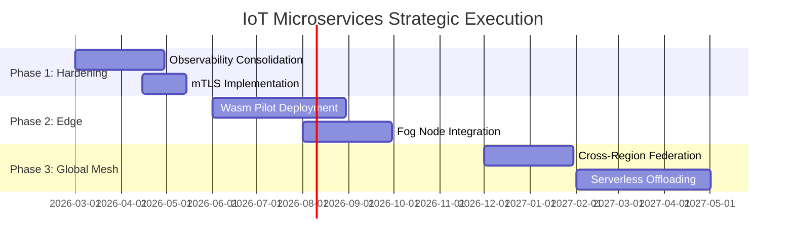

---

<a id="conclusion"></a>
## 🌅 Conclusion: The Horizon of IoT

The IoT Microservices project is a living ecosystem. By moving away from the "Big Ball of Mud" toward highly specialized reactors, we have built a **Resilient Backbone** for the future.

### The Road Ahead: 2026 and Beyond
1.  **Distributed Intelligence**: WebAssembly workers at the gateway level.
2.  **Global Mesh**: Cross-cluster federation for international fleets.
3.  **Autonomous Response**: Closing feedback loops at the Edge via Fog nodes.

---
*End of Volume I: The Engineering Manual.*
*Revised March 2026.*
