<table width="100%" border="1" style="border-collapse: collapse; font-family: Arial, sans-serif; table-layout: fixed; border: 2px solid black; font-size: 0.85em;">
  <tr>
    <td rowspan="2" align="center" width="20%" style="border: 2px solid black; padding: 4px; background-color: #f9f9f9;">
      <b style="font-size: 0.9em; display: block;">HOJA DE PROCESO</b>
      1ºME - TRINIDAD ARROYO
    </td>
    <td rowspan="2" align="center" width="85%" style="border: 2px solid black; padding: 3px; vertical-align: top; background-color: #ffffff;">
      <b style="font-size: 0.85em; display: block; margin-bottom: 2px; border-bottom: 1px solid #eee; padding-bottom: 1px;">CROQUIS DE LA PIEZA:</b>
      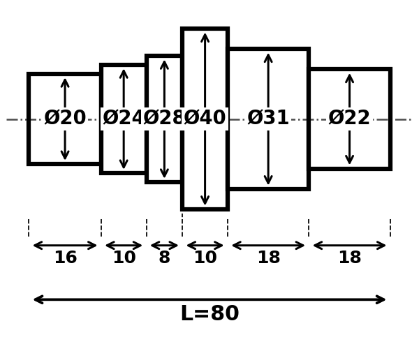
    </td>
    <td width="1%" style="border: 2px solid black; padding: 0px 2px; vertical-align: middle; text-align: center; white-space: nowrap; font-size: 0.7em;">
      <b>Practica:</b> 01
    </td>
  </tr>
  <tr>
    <td style="border: 2px solid black; padding: 0px 2px; vertical-align: middle; text-align: center; white-space: nowrap; font-size: 0.7em;">
      <b>Hoja:</b> 1/2
    </td>
  </tr>
  <tr>
    <td style="border: 2px solid black; padding: 4px; background-color: #fcfcfc;">
      <b>Alumno:</b> Sergio Abad
    </td>
    <td colspan="2" style="border: 2px solid black; padding: 4px; background-color: #fcfcfc;">
      

        <b>Material:</b> Acero AISI 1045
        <b>Bruto:</b> Ø50 x 140 mm
        (Rev. A)
      

    </td>
  </tr>
</table>

| Nº Op. | Operación                          | Herramienta                        | Vc (m/min) | N (rpm) | a(mm/rev) | P (mm) | Croquis |
|--------|------------------------------------|------------------------------------|------------|---------|-----------|--------|---------|
| 1.0    | Colocar tocho y alinear            | —                                  | —          | —       | —         | —      | 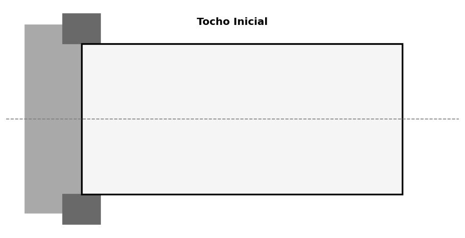 |
| 1.1    | Refrentar cara frontal             | Plaquette torneado derecha         | 120–160    | 800–1000| 0.15–0.25 | 0.5–1  | 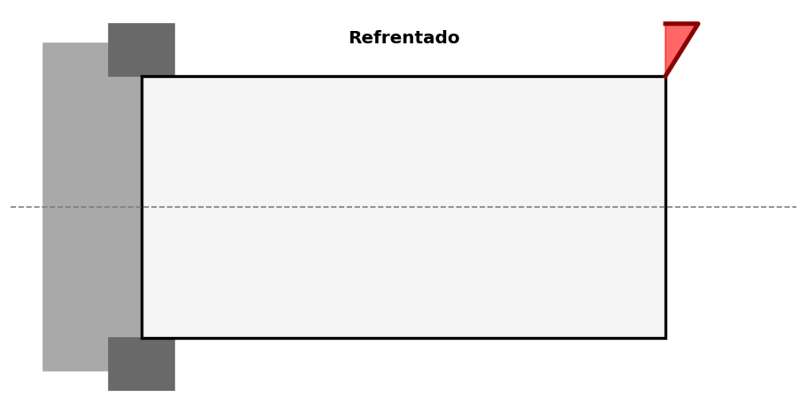 |
| 1.2 | Punteado | Broca centrar Ø4-5 | 15–20 | 400–600 | Man. | 3–5 | 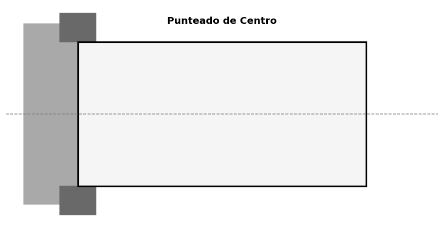 |
| 1.3    | Cilindrar Ø40 (desbaste)           | Plaquette desbaste                 | 100–140    | 600–800 | 0.3–0.5   | 2–3 por pasada |  |
| 1.4    | Cilindrar Ø40 (acabado)            | Plaquette acabado                  | 140–180    | 1000–1200| 0.15–0.25 | 0.3–0.5 |  |
| 1.5    | Cilindrar Ø31 (desbaste)           | Plaquette desbaste                 | 100–130    | 700–900 | 0.3–0.5   | 2–3    | 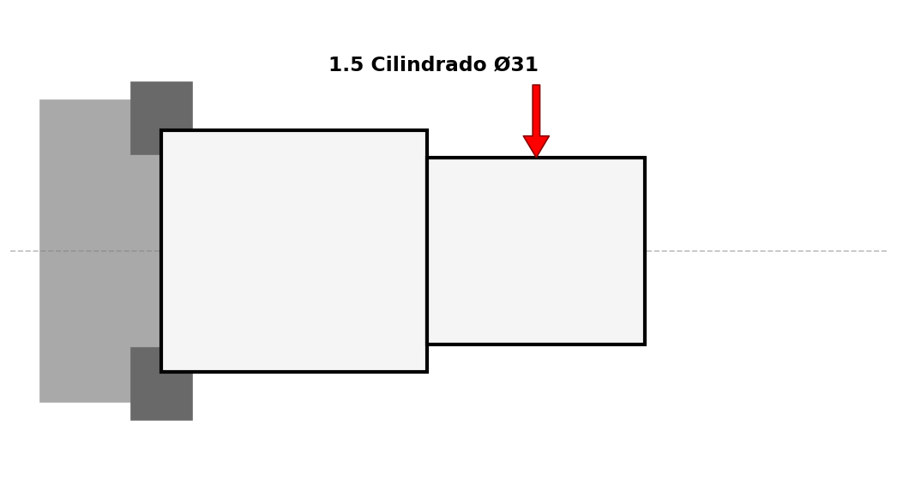 |
| 1.6    | Cilindrar Ø31 (acabado)            | Plaquette acabado                  | 130–170    | 1000–1300| 0.15–0.20 | 0.3    |  |
| 1.7    | Cilindrar Ø22 (desbaste)           | Plaquette desbaste                 | 90–120     | 800–1000| 0.25–0.4  | 2      | 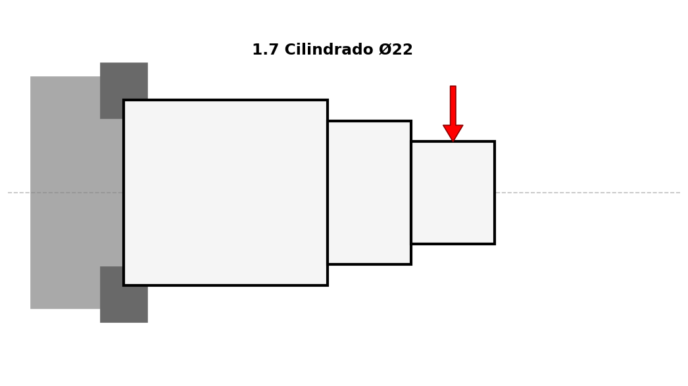 |
| 1.8    | Cilindrar Ø22 (acabado)            | Plaquette acabado                  | 120–160    | 1100–1400| 0.12–0.20 | 0.3    |  |
| 1.9    | Chaflanes / redondeos              | Plaquette o herramienta chaflán 45°| 100–140    | 800–1000| manual    | —      | 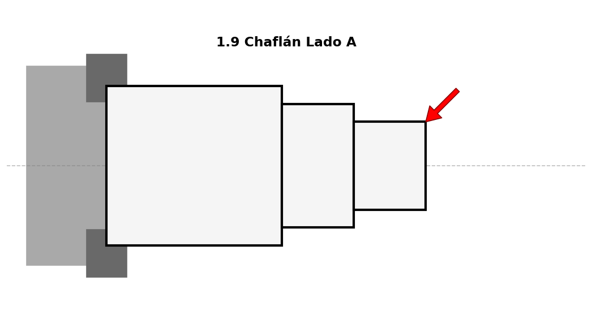 |
| 1.10   | Colocar contrapunto (si no estaba) | Contrapunto fijo o giratorio       | —          | —       | —         | —      | 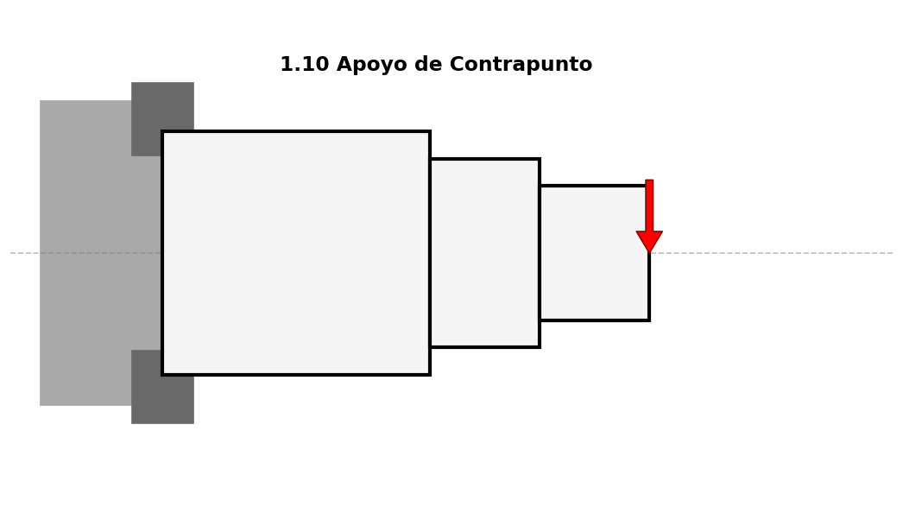 |

<table width="100%" border="1" style="border-collapse: collapse; font-family: Arial, sans-serif; table-layout: fixed; border: 2px solid black; font-size: 0.85em; page-break-before: always;">
  <tr>
    <td rowspan="2" align="center" width="20%" style="border: 2px solid black; padding: 4px; background-color: #f9f9f9;">
      <b style="font-size: 0.9em; display: block;">HOJA DE PROCESO</b>
      1ºME - TRINIDAD ARROYO
    </td>
    <td rowspan="2" align="center" width="85%" style="border: 2px solid black; padding: 3px; vertical-align: top; background-color: #ffffff;">
      <b style="font-size: 0.85em; display: block; margin-bottom: 2px; border-bottom: 1px solid #eee; padding-bottom: 1px;">CROQUIS DE LA PIEZA:</b>
      
    </td>
    <td width="1%" style="border: 2px solid black; padding: 0px 2px; vertical-align: middle; text-align: center; white-space: nowrap; font-size: 0.7em;">
      <b>Practica:</b> 01
    </td>
  </tr>
  <tr>
    <td style="border: 2px solid black; padding: 0px 2px; vertical-align: middle; text-align: center; white-space: nowrap; font-size: 0.7em;">
      <b>Hoja:</b> 2/2
    </td>
  </tr>
  <tr>
    <td style="border: 2px solid black; padding: 4px; background-color: #fcfcfc;">
      <b>Alumno:</b> Sergio Abad
    </td>
    <td colspan="2" style="border: 2px solid black; padding: 4px; background-color: #fcfcfc;">
      

        <b>Material:</b> Acero AISI 1045
        <b>Bruto:</b> Ø50 x 140 mm
        (Rev. A)
      

    </td>
  </tr>
</table>

| Nº Op. | Operación                          | Herramienta                        | Vc (m/min) | N (rpm) | a(mm/rev) | P (mm) | Croquis |
|--------|------------------------------------|------------------------------------|------------|---------|-----------|--------|---------|
| 2.0    | Colocar contrapunto en el punto existente | Contrapunto                   | —          | —       | —         | —      | 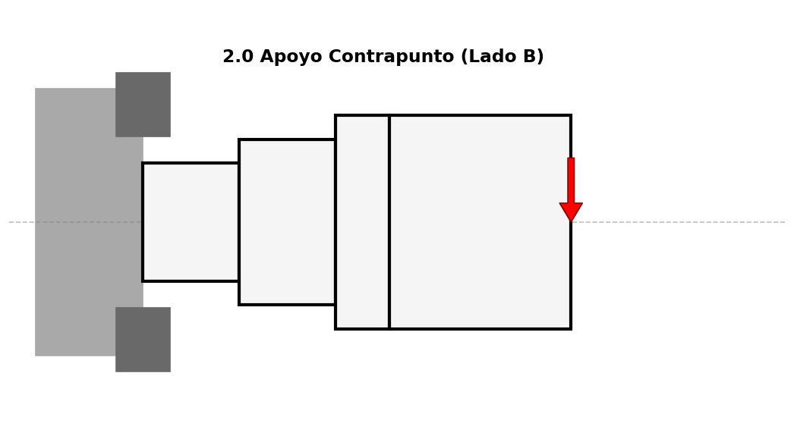 |
| 2.1    | Refrentar cara final               | Plaquette torneado                 | 100–125    | 800–1000| 0.15–0.25 | 0.5–1  | 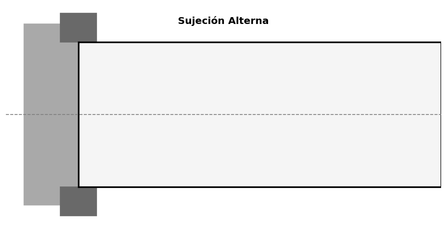 |
| 2.2    | **Punteado (centrado) cara opuesta** | Broca de centrar (Ø4–5 mm)     | 15–20      | 400–600 | Manual / 0.05–0.10 | 3–5 mm total | 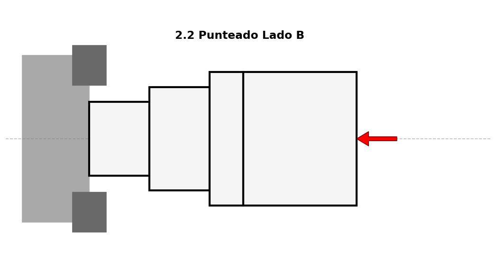 |
| 2.3    | Cilindrar Ø28 (desbaste)           | Plaquette desbaste                 | 90–120     | 700–900 | 0.3–0.5   | 2–3    | 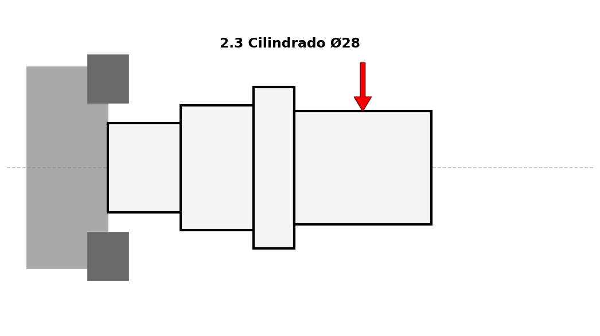 |
| 2.4    | Cilindrar Ø28 (acabado)            | Plaquette acabado                  | 120–150    | 1000–1200| 0.15–0.20 | 0.3    |  |
| 2.5    | Cilindrar Ø24 (desbaste)           | Plaquette desbaste                 | 80–110     | 800–1000| 0.25–0.4  | 2      | 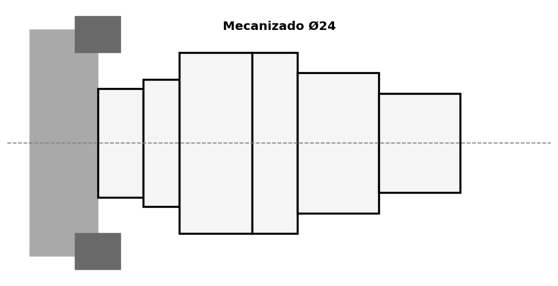 |
| 2.6    | Cilindrar Ø24 (acabado)            | Plaquette acabado                  | 110–140    | 1100–1300| 0.12–0.20 | 0.3    |  |
| 2.7    | Cilindrar Ø20 (desbaste)           | Plaquette desbaste                 | 80–100     | 900–1100| 0.25–0.35 | 1.5–2  | 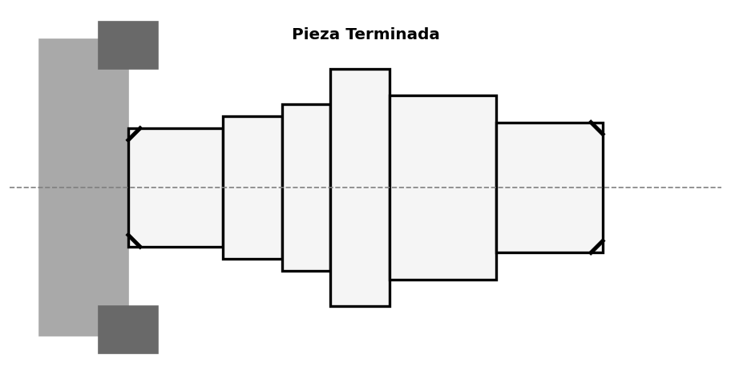 |
| 2.8    | Cilindrar Ø20 (acabado)            | Plaquette acabado                  | 100–130    | 1200–1500| 0.10–0.18 | 0.3    |  |
| 2.9    | Chaflanes / redondeos              | Herramienta chaflán                | 80–110     | 800–1000| manual    | —      | 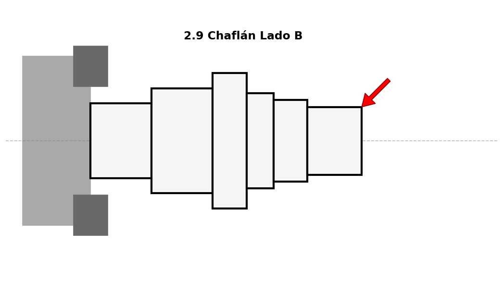 |
| 2.10   | Control dimensional final          | Calibre, micrómetro, etc.          | —          | —       | —         | —      |  |

