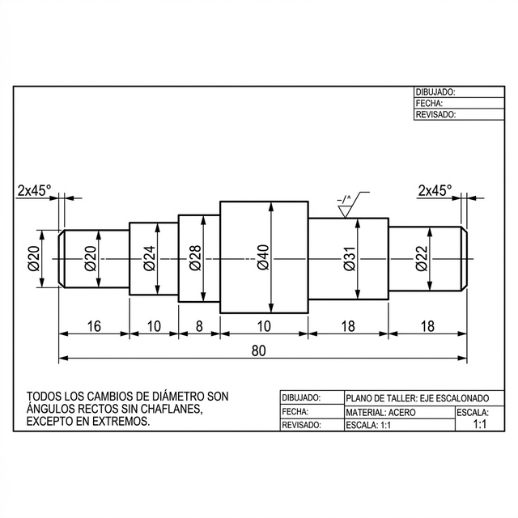

<table width="100%" border="1" style="border-collapse: collapse; font-family: Arial, sans-serif; table-layout: fixed; border: 2px solid black;">
  <tr>
    <td rowspan="2" align="center" width="25%" style="border: 2px solid black; padding: 10px; background-color: #fcfcfc;">
      <h3 style="margin: 0; font-size: 1.2em;">HOJA DE PROCESO</h3>
      
Técnicas de Fabricación

      
1ºME

       
      

        IES TRINIDAD ARROYO
      

    </td>
    <td width="20%" style="border: 2px solid black; padding: 10px; vertical-align: top;">
      <b>PRACTICA Nº:</b> 01
    </td>
    <td rowspan="2" style="border: 2px solid black; padding: 10px; vertical-align: top; background-color: #ffffff;">
      <b>CROQUIS:</b>  
      
    </td>
  </tr>
  <tr>
    <td style="border: 2px solid black; padding: 10px; vertical-align: top;">
      <b>HOJA Nº:</b> 1 / 1
    </td>
  </tr>
  <tr>
    <td style="border: 2px solid black; padding: 10px;">
      <b>Alumno:</b> Roberto Gesteira / Sergio Abad
    </td>
    <td style="border: 2px solid black; padding: 10px;">
      <b>Material:</b> Acero AISI 1045
    </td>
    <td style="border: 2px solid black; padding: 10px;">
      <b>Bruto:</b> Ø50 x 140 mm
    </td>
  </tr>
</table>

¡Claro! He actualizado la **hoja de procesos** incorporando la operación de **punteado** (centrado) con **broca de centrar** (o broca de puntear/center drill) para preparar el soporte del contrapunto en ambos extremos de la pieza.  

Esta operación es esencial cuando se usa contrapunto para piezas largas o para evitar vibraciones en torneado de ejes escalonados como este.

### Actualizaciones clave:
- **Atada 1** (lado inicial): Punteado al final de la primera sujeción, una vez refrentada la cara.
- **Atada 2** (después de dar vuelta): Punteado en la cara opuesta, antes de mecanizar ese lado con contrapunto.
- Herramienta: Broca de centrar tipo A o B (común: Ø 4 mm o Ø 5 mm para ejes de este tamaño, con cono 60° para contrapunto estándar).
- Parámetros típicos: Baja velocidad (300–600 rpm), avance manual lento o 0.05–0.10 mm/rev, con refrigerante. Profundidad: suficiente para que el contrapunto entre bien (aprox. 3–5 mm total, dependiendo del tamaño de la broca).
- Secuencia lógica: Siempre puntear **después de refrentar** la cara (para que quede perpendicular y centrada).

### Hoja de Procesos Actualizada – Pieza: Eje Escalonado

**Datos generales**  
- Pieza: Eje escalonado  
- Código / Dibujo: [tu referencia]  
- Material: Acero AISI 1045 (o equivalente)  
- Tocho inicial: Ø50 × 140 mm (aprox.)  
- Máquina: Torno paralelo / Torno CNC  
- Operario: [nombre o puesto]  
- Fecha: Marzo 2026  
- Cantidad: [1 / lote]  

**Fase 1 – Preparación y sujeción inicial (Atada 1)**  
Sujeción: Plato de 3 garras + contrapunto (usar luneta si necesario).  
Longitud útil aprox. 100–110 mm desde el plato.

| Nº Op. | Operación                          | Herramienta                        | Vc (m/min) | N (rpm) | a(mm/rev) | P (mm) | Notas / Medidas clave                                      | Croquis |
|--------|------------------------------------|------------------------------------|------------|---------|-----------|--------|------------------------------------------------------------|---------|
| 1.0    | Colocar tocho y alinear            | —                                  | —          | —       | —         | —      | Asegurar concentricidad inicial                            |  |
| 1.1    | Refrentar cara frontal             | Plaquette torneado derecha         | 120–160    | 800–1000| 0.15–0.25 | 0.5–1  | Dejar longitud total ≈  +2 mm sobrematerial                 |  |
| 1.2    | **Punteado (centrado) para contrapunto** | Broca de centrar (Ø4–5 mm)   | 15–20      | 400–600 | Manual / 0.05–0.10 | 3–5 mm total | Montar en contrapunto o portabrocas; avanzar lento; cono 60° perfecto para contrapunto. Usar refrigerante. |  |
| 1.3    | Cilindrar Ø40 (desbaste)           | Plaquette desbaste                 | 100–140    | 600–800 | 0.3–0.5   | 2–3 por pasada | Hasta Ø41–42 mm                                            |  |
| 1.4    | Cilindrar Ø40 (acabado)            | Plaquette acabado                  | 140–180    | 1000–1200| 0.15–0.25 | 0.3–0.5 | Ø40 mm final                                               |  |
| 1.5    | Cilindrar Ø31 (desbaste)           | Plaquette desbaste                 | 100–130    | 700–900 | 0.3–0.5   | 2–3    | Longitud aprox. 36 mm + margen                             |  |
| 1.6    | Cilindrar Ø31 (acabado)            | Plaquette acabado                  | 130–170    | 1000–1300| 0.15–0.20 | 0.3    | Ø31 mm                                                     |  |
| 1.7    | Cilindrar Ø22 (desbaste)           | Plaquette desbaste                 | 90–120     | 800–1000| 0.25–0.4  | 2      | Longitud aprox. 18 mm + margen                             |  |
| 1.8    | Cilindrar Ø22 (acabado)            | Plaquette acabado                  | 120–160    | 1100–1400| 0.12–0.20 | 0.3    | Ø22 mm                                                     |  |
| 1.9    | Chaflanes / redondeos              | Plaquette o herramienta chaflán 45°| 100–140    | 800–1000| manual    | —      | Chaflanes 1×45° en todos los escalones                     |  |
| 1.10   | Colocar contrapunto (si no estaba) | Contrapunto fijo o giratorio       | —          | —       | —         | —      | Apoyar en el punto centrado; ajustar presión moderada     |  |

**Cambio de sujeción – Atada 2**  
Dar vuelta la pieza, sujetar por Ø40 mm (usar mordazas blandas o protector). Usar contrapunto en el centro punteado del lado opuesto.

| Nº Op. | Operación                          | Herramienta                        | Vc (m/min) | N (rpm) | a(mm/rev) | P (mm) | Notas / Medidas clave                                      | Croquis |
|--------|------------------------------------|------------------------------------|------------|---------|-----------|--------|------------------------------------------------------------|---------|
| 2.0    | Colocar contrapunto en el punto existente | Contrapunto                   | —          | —       | —         | —      | Verificar alineación y presión                             |  |
| 2.1    | Refrentar cara final               | Plaquette torneado                 | 100–125    | 800–1000| 0.15–0.25 | 0.5–1  | Longitud total final 80 mm (o según plano)                 |  |
| 2.2    | **Punteado (centrado) cara opuesta** | Broca de centrar (Ø4–5 mm)     | 15–20      | 400–600 | Manual / 0.05–0.10 | 3–5 mm total | Avanzar con contrapunto; asegurar perpendicularidad; refrigerante. |  |
| 2.3    | Cilindrar Ø28 (desbaste)           | Plaquette desbaste                 | 90–120     | 700–900 | 0.3–0.5   | 2–3    | Longitud aprox. 34 mm + margen                             |  |
| 2.4    | Cilindrar Ø28 (acabado)            | Plaquette acabado                  | 120–150    | 1000–1200| 0.15–0.20 | 0.3    | Ø28 mm                                                     |  |
| 2.5    | Cilindrar Ø24 (desbaste)           | Plaquette desbaste                 | 80–110     | 800–1000| 0.25–0.4  | 2      | Longitud aprox. 26 mm                                      |  |
| 2.6    | Cilindrar Ø24 (acabado)            | Plaquette acabado                  | 110–140    | 1100–1300| 0.12–0.20 | 0.3    | Ø24 mm                                                     |  |
| 2.7    | Cilindrar Ø20 (desbaste)           | Plaquette desbaste                 | 80–100     | 900–1100| 0.25–0.35 | 1.5–2  | Longitud aprox. 16 mm                                      |  |
| 2.8    | Cilindrar Ø20 (acabado)            | Plaquette acabado                  | 100–130    | 1200–1500| 0.10–0.18 | 0.3    | Ø20 mm                                                     |  |
| 2.9    | Chaflanes / redondeos              | Herramienta chaflán                | 80–110     | 800–1000| manual    | —      | Todos los escalones                                        |  |
| 2.10   | Control dimensional final          | Calibre, micrómetro, etc.          | —          | —       | —         | —      | Verificar todas medidas + concentricidad                   |  |

**Notas adicionales sobre punteado**
- Usa siempre **broca de centrar** (no broca normal) porque crea un cono preciso de 60° que coincide con el ángulo del contrapunto.
- Si el torno es CNC, esta operación se puede programar como ciclo G81 o manual.
- En producción en serie, haz el punteado en ambos extremos antes de cualquier torneado extenso para maximizar rigidez.
- Si la pieza es muy larga o delgada, considera luneta fija/móvil después del punteado.

¿Quieres agregar más detalles (por ejemplo, si hay taladrado axial completo, roscado, o parámetros más precisos para CNC)? ¿O prefieres una versión en formato tabla más simple para imprimir? ¡Avísame!