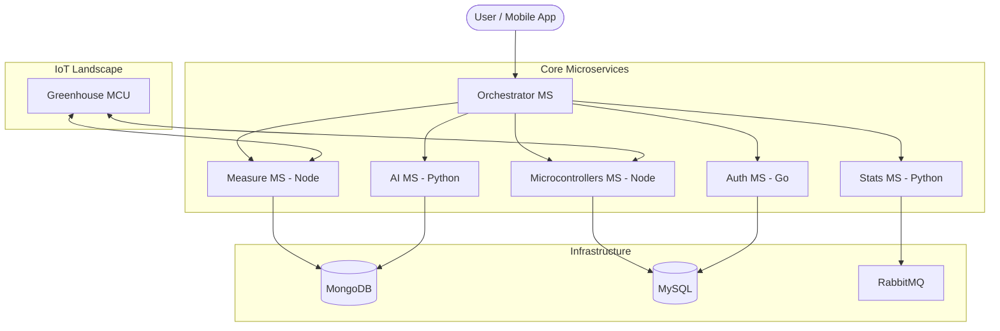

# 🌿 IoT Microservices: Greenhouse Automation & Analytics

A robust, enterprise-grade IoT ecosystem for remote monitoring and automation of smart greenhouses. This project leverages a microservices architecture to provide real-time sensing, AI-driven forecasting, and secure device management.

## 🏗 System Architecture

## 🚀 Key Features

- **100% TDD Foundation**: Every core microservice is verified with 100% statement and branch coverage.
- **AI Forecasting**: LSTM-based modeling for predicting environmental trends (Humidity, Temperature).
- **Advanced Verification**:
  - **Mutation Testing**: Using Stryker and Mutmut to verify test quality.
  - **Contract Testing**: Pact CDC implementation for microservice compatibility.
  - **Fuzz Testing**: Input resilience testing for the API Gateway.
- **Secure by Design**: JWT-based authentication with internal API-key guarding for service-to-service communication.
- **Fully Containerized**: Kubernetes (GKE) ready with optimized Dockerfiles and Helm charts.

## 🧪 Testing State

This project is built with a **Test-Driven Development (TDD)** first approach.

- **Unit Tests**: `Jest` (Node), `Pytest` (Python), `Go internal` (Go).
- **Coverage Summary**: See [CURRENT_COVERAGE.md](CURRENT_COVERAGE.md).
- **Contract Verification**: Pact files are located in `orchestrator-ms/pacts/`.
- **Quality Metrics**: [Timeline.md](Timeline.md) tracks the progress towards 100% coverage and advanced quality.

## 🛠 Tech Stack

- **Backend**: Node.js (Express), Go, Python (Flask/TensorFlow).
- **Storage**: MongoDB, MySQL, Redis (Cache).
- **Communication**: REST API, RabbitMQ, WebSockets.
- **Frontend**: Angular 19+ with SCSS.
- **DevOps**: Docker, K8s, GitHub Actions, Terraform.

## 📜 Documentation

- [Project Roadmap & Timeline](Timeline.md)
- [TDD TODO List](TODO.md)
- [Architecture Details](Documentation/Version_1/Book_Version_1.md)
- [GCP Infrastructure Costs](COSTS05032026.md)

---
*Maintained with ❤️ by Rocky*
