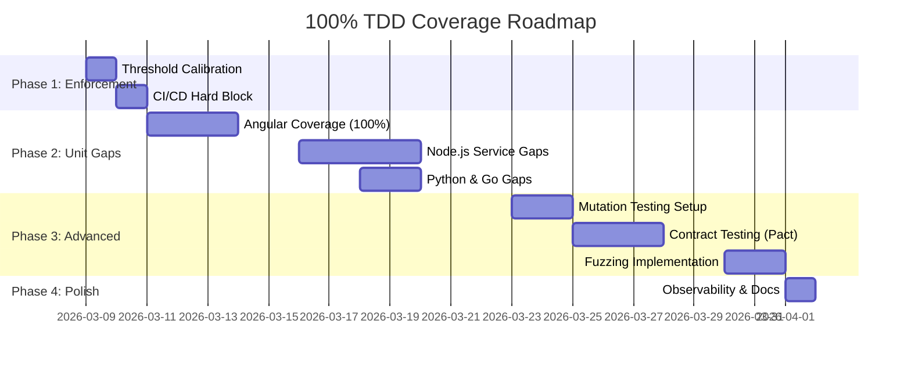

# ⏳ Project Timeline: Achieving 100% TDD Coverage

This document provides a realistic time estimate for implementing the tasks outlined in `TODO.md`. The goal is to move the current high-coverage baseline (93-98%) to a flawless 100% with advanced quality verification.

## 📈 Summary of Work
- **Total Estimated Effort**: ~76 Hours
- **Projected Duration**: 2 - 3 Weeks (depending on developer allocation)
- **Primary Focus**: Closing branch coverage gaps and implementing resilience testing.

---

## 📅 Breakdown by Phase

### Phase 1: Strict Enforcement & Baseline Prep
| Task | Estimated Time | Focus |
| :--- | :--- | :--- |
| Global Threshold Calibration | 2 Hours | Updating 10+ configuration files. |
| CI/CD Hard Block Implementation | 2 Hours | GitHub Actions workflows and local git hooks. |
| **Subtotal** | **4 Hours** | |

### Phase 2: Closing the Unit Gaps (The "Last Mile")
| Target Service | Estimated Time | Complexity |
| :--- | :--- | :--- |
| **Angular Frontend** | 12 Hours | High (Branch coverage on complex UI logic/pipes). |
| **Node.js Microservices** | 16 Hours | Medium (Error path exhaustion & graceful shutdowns). |
| **Python Services** | 8 Hours | Medium (Model loading exceptions & Pika heartbeat loss). |
| **Go Auth Service** | 4 Hours | Low (SQL mock error injections). |
| **Subtotal** | **40 Hours** | |

### Phase 3: Advanced Verification (Quality Assurance)
| Task | Estimated Time | Focus |
| :--- | :--- | :--- |
| Mutation Testing (Stryker/Mutmut) | 8 Hours | Identifying "silent" test failures. |
| Contract Testing (Pact) | 12 Hours | Cross-service API interface validation. |
| Fuzz Testing Setup | 8 Hours | Boundary testing for the API Gateway. |
| **Subtotal** | **28 Hours** | |

### Phase 4: Observability & Polish
| Task | Estimated Time | Status |
| :--- | :--- | :--- |
| Live Coverage Badges | 2 Hours | Dynamic reporting via CI artifacts. |
| Documentation Sync (OpenAPI) | 2 Hours | Ensuring 100% parity with logic. |
| **Subtotal** | **4 Hours** | |

---

## 📊 GANTT Diagram (Project Roadmap)

---
*Last Estimated: 2026-03-06*
*Note: Timelines assume dedicated development cycles.*
