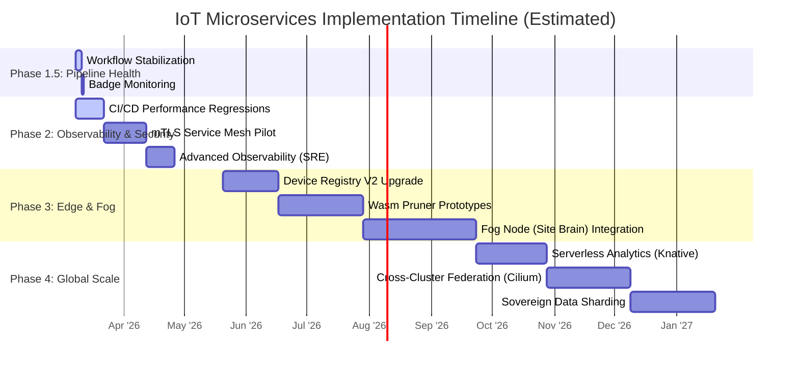

# ⏳ IoT Microservices: Strategic Execution Timeline

This document outlines the estimated time and effort required to execute the remaining strategic tasks defined in `TODO.md`. The estimates are based on industry standards for implementing these architectural expansions in a microservices environment.

## 📊 High-Level Gantt Chart Roadmap

---

## 📅 Detailed Task Breakdown & Estimates
### 🔵 Phase 1.5: GitHub Actions Pipeline Health (Est: 4 Days)
Focus on resolving pending errors and stabilizing the existing CI/CD pipelines before advancing further.

| Task | Estimated Effort | Complexity | Description |
| :--- | :--- | :--- | :--- |
| **Workflow Stabilization** | **3 Days** | Low | Review and execute all `.github/workflows/*.yml` pipelines. Resolve broken dependencies, outdated container images, or missing SECRETS. |
| **Badge Monitoring** | **1 Day** | Low | Ensure that the "Build" indicator badge on the README correctly reflects a reliable 100% pass rate in the cloud runner. |

### 🟡 Phase 2: Closing the Unit Gaps & Observability (Est: 7 Weeks)
Focus on internal security hardening and expanding the SRE platform capabilities.

| Task | Estimated Effort | Complexity | Description |
| :--- | :--- | :--- | :--- |
| **mTLS Service Mesh Pilot** | **3 Weeks** | High | Deploying Istio/Linkerd. Learning curve for configuring sidecar proxies. Piloting exclusively on `auth-ms` -> `orchestrator-ms` to prevent cluster-wide outages during rollout. |
| **Advanced Observability HQ** | **2 Weeks** | Medium | Aggregating Promtail/Loki logs with Prometheus metrics. Building correlated Grafana dashboards. Setting up alerting rules for threshold breaches. |
| **CI/CD Maturity (Perf Tests)** | **2 Weeks** | Medium | Integrating load-testing frameworks (e.g., K6) into GitHub Actions. Setting up baseline latency metrics and enforcing CI failure on degradation. |

### 🟠 Phase 3: Edge Intelligence & Fog Deployment (Est: 18 Weeks)
Focus on decentralizing compute to the physical network edge to save cloud bandwidth bounds.

| Task | Estimated Effort | Complexity | Description |
| :--- | :--- | :--- | :--- |
| **Device Registry V2** | **4 Weeks** | Medium | Modifying `microcontrollers-ms` schema. Implementing zero-conf discovery protocols so physical hardware can automatically pair with local gateways. |
| **Wasm Ingestion Prototypes** | **6 Weeks** | High | Writing Rust/C++ pruning logic. Compiling to `.wasm`. Deploying Wasmtime environments on physical site infrastructure. Validating data fidelity post-pruning. |
| **Fog Node Integration** | **8 Weeks** | Very High | Building the "Site Brain". Implementing offline-survival logic for greenhouse automation. Syncing local caching databases with the central K8s cluster. |

### 🔴 Phase 4: Global Mesh & Infinite Scale (Est: 17 Weeks)
Focus on extreme geo-distribution, cost-efficiency, and global residency compliance.

| Task | Estimated Effort | Complexity | Description |
| :--- | :--- | :--- | :--- |
| **Serverless Offloading** | **5 Weeks** | High | Rewriting `stats-ms` deployment manifests for Knative Serving. Setting up Eventing triggers so analytics pods scale to 0 when RabbitMQ queues are empty. |
| **Cross-Cluster Mesh (Cilium)** | **6 Weeks** | Very High | Establishing secure IPSec/Wireguard tunnels between EU and US K8s clusters. Managing global DNS and BGP routing for active-active failover scenarios. |
| **Sovereign Sharding** | **6 Weeks** | High | Transitioning MongoDB from a Replica Set to a Sharded Cluster. Configuring Zone Tags based on user geolocation attributes. Performing live data migrations safely. |

---
*Generated by AI Assistant on 2026-03-08*
